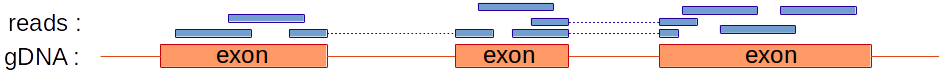
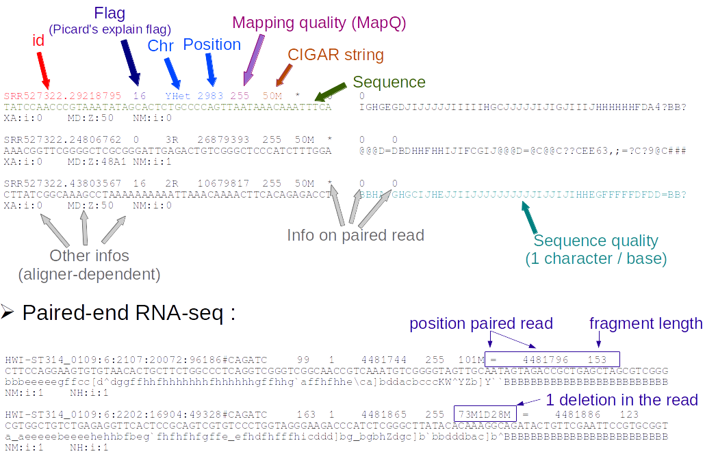

```{r setup, include=FALSE}
knitr::opts_chunk$set(echo = TRUE)
```


# Outline

 1. What is NGS? Why BioC for NGS?
 2. Working with sequences
 3. Working with aligned reads
 4. Working with ranges
 5. Annotations
 6. Import / Export 
 7. Visualization

# Outline
 1. What is NGS? Why BioC for NGS?
 2. <span style="color:grey">Working with sequences</span>
 3. <span style="color:grey">Working with aligned reads</span>
 4. <span style="color:grey">Working with ranges</span>
 5. <span style="color:grey">Annotations</span>
 6. <span style="color:grey">Import / Export</span>
 7. <span style="color:grey">Visualization</span>


# NGS development


# NGS basics


# How does NGS work?
Illumina sequencing: bridge PCR (illustrations from [atdbio](https://www.atdbio.com/content/58/Next-generation-sequencing))


# Illumina sequencing
Illustrations from [NMBU](http://wiki.nmbu.org/index.php/Illumina_(Solexa)_sequencing)


# Other technologies?


# Increased throughput
... and decreased prices


# Bioconductor


# Bioconductor and the NGS workflow


# Bioconductor and the NGS workflow


# Specialized packages for about anything...
* RNA-seq / Differential expression analysis:  
    + <span style="color:chocolate">limma, DESeq2, edgeR, DEXseq, spliceR, rnaSeqMap, ...</span>
* ChIP-seq / peak finding / annotation:
    + <span style="color:chocolate">ChIPQC, chipseq, NarrowPeaks, DiffBind, MMDiff, epigenomix, jmosaics, csaw, ChIPseeker...</span>
* DNA methylation / DMR:
    + <span style="color:chocolate">bsseq, BiSeq, methylumi, minfi, Rnbeads, ...</span>
* 3C/4C/Hi-C/ChIA-PET / genomic interactions:
    + <span style="color:chocolate">r3Cseq, FourCSeq HiTC , GOTHiC, GenomicInterations, InteractionSet, ...</span>
* CAGE-seq: <span style="color:chocolate;font-size:80%"><i>TSSi, CAGEr, ...</i></span>
* DNAse-seq: <span style="color:chocolate;font-size:80%"><i>DNaseR, ...</i></span>
* MNase-seq: <span style="color:chocolate;font-size:80%"><i>PING, ...</i></span>
* ...   


# Outline
 1. <span style="color:grey">What is NGS? Why BioC for NGS?</span>
 2. Working with sequences
 3. <span style="color:grey">Working with aligned reads</span>
 4. <span style="color:grey">Working with ranges</span>
 5. <span style="color:grey">Annotations</span>
 6. <span style="color:grey">Import / Export</span>
 7. <span style="color:grey">Visualization</span>

# The fasta format


* Extension: .fa; .fasta  
<https://en.wikipedia.org/wiki/FASTA_format>


# Biostrings containers and accessors
```{r  warning=F,message=F}
library(Biostrings)
```

**Containers:**  

- XString – BString, DNAString, RNAString, AAString  
- XStringSet – multiple sequences  
- XStringViews  
  
*"Masked" sequences are also supported (see ?masks)*  
  

**Manipulation:**  

- [[ and [ for subsetting  
- subseq
- toString  
- Views  
...

# Importing sequences from a fasta file
```{r cache=T}
dm3_upstream_filepath <- system.file("extdata","dm3_upstream2000.fa.gz",
                                    package="Biostrings")
dm3_upstream <- readDNAStringSet(dm3_upstream_filepath)
dm3_upstream
dm3_upstream[[5]]
```


# Working with your own DNA sequence  
  
Like `LETTERS` in base R, the [Biostrings](http://bioconductor.org/packages/release/bioc/html/Biostrings.html) package provides a `DNA_ALPHABET`.  
  
  
- Use it to create a  `DNAString`  object containing a random sequence of length 50.
- Get the reverse complement of this sequence
- Calculate the frequency of each A, T, G and C in your sequence.
- Calculate the GC% of your sequence
- Extract the nucleotides between 11 and 20.
- Convert the sequence to a character string
- Extract the first 5 bases every 10 bases

_Note that masks can also be associated to Biostrings and BSgenome objects_


# Working with large fasta files
The [Rsamtools](http://bioconductor.org/packages/release/bioc/html/Rsamtools.html) package provides function to work with large fasta file(s).  
The <span style="color:blue">FaFile</span> function creates a reference to an indexed fasta file (see `?FaFile`).  

This is particularly useful to extract sequences within a fasta file:

```{r, cache=TRUE, warning=F, message=F}
library(Rsamtools)
fl <- system.file("extdata", "ce2dict1.fa", package="Rsamtools",
                  mustWork=TRUE)
fa <- open(FaFile(fl))
seqinfo(fa)

getSeq(fa, GRanges("pattern05:11-20"))
```


# Whole genome sequences in BSgenome packages
```{r  warning=F,message=F}
library(BSgenome.Dmelanogaster.UCSC.dm3)
```

```{r cache=T}
names(Dmelanogaster)[1:5]
Dmelanogaster$chr2L
```


For a masked version of the genome, see:
```{r eval=F}
library(BSgenome.Dmelanogaster.UCSC.dm3.masked)
```


For adding SNPs info see:
```{r eval=F}
library(BSgenome)
?available.SNPs
```

# Pattern matching


```{r cache=T}
matchPattern("KATCGATA", dm3_upstream[[592]], fixed=FALSE)
```
*K is G or T, see [IUPAC code](http://www.bioinformatics.org/sms/iupac.html)* 
  
Other functions to search for patterns: <span style="color:blue">matchProbePair, findPalindromes, ...</span>

```{r eval=F}
vmatchPattern('TATCGATA', Dmelanogaster)
```

# Position weight matrix (PWM)
Probabilistic description of short sequences largely used for TF binding sites  
```{r,echo=F,warning=F,message=F}
library(MotifDb);library(seqLogo)
```
Get a motif:
```{r cache=T}
EcRMotif <- MotifDb::query(MotifDb,"EcR")[1]
```

seqLogo representation:  
```{r echo=F,cache=T,fig.height=4,fig.width=5,fig.align='center'}
seqLogo::seqLogo(reverseComplement(EcRMotif[[1]]))
```
Convert to PWM:
```{r}
EcRpfm <- apply(EcRMotif[[1]] * as.integer(elementMetadata(EcRMotif)$sequenceCount),
                2, as.integer)
rownames(EcRpfm) <- rownames(EcRMotif[[1]])
EcRpwm <- PWM(EcRpfm)
```

Search the motif in chr4 ('+' strand only):
```{r warning=F,cache=T}
EcRHits <- matchPWM(EcRpwm, Dmelanogaster$chr4)
length(EcRHits)
EcRHits[1:2]
```

For minus strand: use the <span style="color:blue">reverseComplement</span> of PWM

# Motif pipeline example
A typical pipeline:  
  
- Find a set of ChIP-seq peaks for a TF as a bed file (eg. [ENCODE](https://www.encodeproject.org/) or [modENCODE](http://www.modencode.org/).  
  
- Use a de novo motif search to identify enriched motifs (e.g. [RSAT](http://pedagogix-tagc.univ-mrs.fr/rsat/RSAT_portal.html), [MEME](http://meme-suite.org/), [BaMM motif](https://bammmotif.mpibpc.mpg.de/), R [BCRANK](http://bioconductor.org/packages/release/bioc/html/BCRANK.html))  
  
- Get a PFM or PWM from the results  
  
- Scan the genome with this PWM  
  
- Annotate the identified motif location (TSS? enhancers? near specific groups of genes? etc.)  
  
- ...  

# More sequence tools:

**Other packages to work with motifs:**  
- [MotifDb](http://bioconductor.org/packages/release/bioc/html/MotifDb.html)  
- [seqLogo](http://bioconductor.org/packages/release/bioc/html/seqLogo.html)  
- [PWMEnrich](http://bioconductor.org/packages/release/bioc/html/PWMEnrich.html)  
- [TFBSTools](http://bioconductor.org/packages/release/bioc/html/TFBSTools.html)  
- [rGADEM](http://bioconductor.org/packages/release/bioc/html/rGADEM.html)  
- [BCRANK](http://bioconductor.org/packages/release/bioc/html/BCRANK.html)  
- [MotIV](http://bioconductor.org/packages/release/bioc/html/MotIV.html)  
- ...  

**For database queries (+ other tools for AA sequences):**  
[seqinr](https://cran.r-project.org/package=seqinr)  

# Sequence alignment

<span style="color:blue">pairwiseAlignment</span> is the core function:
```{r, cache=T}
pairwiseAlignment('CTTGCAGTGGTGTATTCATAC',
                  dm3_upstream[[1]],
                  type='global-local')
```

Levensthein edit distance:
```{r}
stringDist(c("lazy", "HaZy", "crAzY"))
stringDist(c("lazy", "HaZy", "crAzY"), ignoreCase = TRUE)
```


# Exercise: compare indexes
Consider a sequencing run with 10 multiplexed samples. We have the following 16 indexes available.  

```{r}
indx <- DNAStringSet( c("ATCACG", "CGATGT", "TTAGGC", "TGACCA",
                        "ACAGTG", "GCCAAT", "CAGATC", "ACTTGA",
                        "GATCAG", "TAGCTT", "GGCTAC", "CTTGTA",
                        "CGGCTA", "TCCGCG", "ATGTCA", "AGCGAT"))
```

- Use the `stringDist` function to compare these indexes and choose the 10 "best" indexes 
- Evaluate if all 4 bases are sequenced at each sequencing cycles (use the `consensusMatrix` function)


# Fastq format
* Extension: .fq; .fastq <https://en.wikipedia.org/wiki/FASTQ_format>

  

$Q = -10*{\log_{10}(P)}$ <=> $P = 10^{-\frac{Q}{10}}$


# Working with fastq files
The [ShortRead](http://bioconductor.org/packages/release/bioc/html/ShortRead.html) package <span class="citeref">[@pmid19654119]</span>
```{r warning=F,message=F}
library(ShortRead)
```

Import a fastq file with 20K reads:
```{r cache=T}
fq1_path <- system.file(package="ShortRead","extdata","E-MTAB-1147",
                        "ERR127302_1_subset.fastq.gz")
myFastq <- readFastq(fq1_path)
```

Explore with:
```{r}
myFastq
myFastq[1:5]
```

----
```{r}
head(sread(myFastq), 2)
head(quality(myFastq), 2)
head(id(myFastq), 2)
encoding(quality(myFastq))[seq(1,51,by=2)]
alphabet(sread(myFastq))[1:4]
```


# Large fastq files
Functions <span style="color:blue">FastqSampler</span> and <span style="color:blue">FastqStreamer</span>  
Count the reads in a fastq file:
```{r, cache=T}
nr_myFastq <- 0
strm <- FastqStreamer(fq1_path,1000)
repeat {
 ## Get FASTQ chunk:
  fq <- yield(strm)
  if (length(fq) == 0)
   break
 ## Do something on the chunk:
  nr_myFastq <- nr_myFastq + length(fq)
}
close(strm) #close the connection
nr_myFastq
```


# QC on fastq files
[fastqc](http://www.bioinformatics.babraham.ac.uk/projects/fastqc/) from Babraham  

Several tools available in R/BioC: [ShortRead](http://bioconductor.org/packages/release/bioc/html/ShortRead.html) <span style="color:blue">qa</span>/<span style="color:blue">qa2</span> functions, [qrqc](http://bioconductor.org/packages/release/bioc/html/qrqc.html), [seqTools](http://bioconductor.org/packages/release/bioc/html/seqTools.html), [Rqc](http://bioconductor.org/packages/release/bioc/html/Rqc.html)  


# Filtering a fastq file

Define some filters:
```{r cache=T}
max1N <- nFilter(threshold=1L) #No 'Ns' in the reads
goodq <- srFilter(function(x){apply(as(quality(x),"matrix"),
                            1,median,na.rm=T)>=30},
                 name="MedianQualityAbove30")
myFilter <- compose(max1N,goodq) #combine filters
```

Create a function to filter and trim the reads:
```{r cache=T}
FilterAndTrim <- function(fl,destination=sprintf("%s_filtered",fl))
{
  stream <- FastqStreamer(fl) ## open input stream
  on.exit(close(stream))
  repeat {
    ###get fastq chunk  
    fq <- yield(stream)
    if (length(fq)==0)
      break
    ###TRIM first 4 and last 2 bases
    fq <- narrow(fq,start=5,end=70)
    ###FILTER
    fq <- fq[myFilter(fq)]
    ###write filtered fastq
    writeFastq(fq, destination, mode="a")
  }
}
```

----

Apply the function:
```{r eval=F}
FilterAndTrim(fqFiles[1],
              destination=file.path(getwd(),"FilteredFastq.fq"))
```


# Outline
 1. <span style="color:grey">What is NGS? Why BioC for NGS?</span>
 2. <span style="color:grey">Working with sequences</span>
 3. Working with aligned reads
 4. <span style="color:grey">Working with ranges</span>
 5. <span style="color:grey">Annotations</span>
 6. <span style="color:grey">Import / Export</span>
 7. <span style="color:grey">Visualization</span>


# Alignment of NGS reads
R packages: [Rbowtie](http://bioconductor.org/packages/release/bioc/html/Rbowtie.html), [QuasR](http://bioconductor.org/packages/release/bioc/html/QuasR.html) <span class="citeref">[@pmid25417205]</span>, [Rsubread](http://bioconductor.org/packages/release/bioc/html/Rsubread.html) <span class="citeref">[@pmid23558742; @pmid24227677]</span>  
  
__[Mapping quality](http://genome.sph.umich.edu/wiki/Mapping_Quality_Scores) scores__ <span class="citeref">[MAQ aligner in @pmid18714091]</span>:  
- base qualities (Phred scores)  
- mismatches/indels  
- repetitions  
- paired reads  

* __Aligning unspliced reads:__  
     + [Bowtie](http://bowtie-bio.sourceforge.net/index.shtml) <span class="citeref">[@pmid19261174]</span> / [Bowtie2](http://bowtie-bio.sourceforge.net/bowtie2/index.shtml) <span class="citeref">[@pmid22388286]</span>; [BWA](http://bio-bwa.sourceforge.net/) <span class="citeref">[@pmid19451168; @pmid20080505]</span>; [GEM mapper](http://algorithms.cnag.cat/wiki/The_GEM_library) <span class="citeref">[@pmid23103880]</span>  
  
* __Aligning spliced reads__  
     + [TopHat2](http://ccb.jhu.edu/software/tophat/index.shtml) <span class="citeref">[@pmid19289445; @pmid23618408]</span> / [HISAT2](http://ccb.jhu.edu/software/hisat2/index.shtml) <span class="citeref">[@pmid25751142]</span>; [MapSplice](http://www.netlab.uky.edu/p/bioinfo/MapSplice) <span class="citeref">[@pmid20802226]</span>; [STAR](https://github.com/alexdobin/STAR) <span class="citeref">[@pmid23104886]</span>  



See also [Wikipedia's list of alignment tools](https://en.wikipedia.org/wiki/List_of_sequence_alignment_software)  


# SAM/BAM format


[SAM format specifications](https://github.com/samtools/hts-specs)  
Useful tools: [samtools](http://www.htslib.org/), [Picard tools](http://broadinstitute.github.io/picard/)


# BAM file import

```{r}
library(Rsamtools);library(GenomicAlignments)
library(pasillaBamSubset)
sr <- untreated1_chr4() #single-end
pr <- untreated3_chr4() #paired-end
```

Use samtools to index the file
```{r eval=F}
indexBam(sr_bamFile)
```

----

Define what to import
```{r cache=T}
which=GRanges(seqnames="chr4",
              ranges=IRanges(c(75000,1190000),
                             c(85000,1203000)),
              strand="*")
what = c("rname","strand","pos","qwidth","seq")
flag=scanBamFlag(isDuplicate=FALSE)
param=ScanBamParam(which=which,what=what,flag=flag)
```

import single-end reads
```{r cache=T}
srbam <- readGAlignments(sr,param=param)
srbam[1:2]
```

import paired-end reads
```{r warning=F, cache=T}
prbam <- readGAlignmentPairs(pr)
prbam[1:2]
```


# Outline
 1. <span style="color:grey">What is NGS? Why BioC for NGS?</span>
 2. <span style="color:grey">Working with sequences</span>
 3. <span style="color:grey">Working with aligned reads</span>
 4. Working with ranges
 5. <span style="color:grey">Annotations</span>
 6. <span style="color:grey">Import / Export</span>
 7. <span style="color:grey">Visualization</span>


# Working with genomic ranges

Packages [IRanges](http://bioconductor.org/packages/release/bioc/html/IRanges.html) & [GenomicRanges](http://bioconductor.org/packages/release/bioc/html/GenomicRanges.html) <span class="citeref">[@pmid23950696]</span>  
See also the [Introduction by Martin Morgan, 2014](http://master.bioconductor.org/help/course-materials/2014/SeattleFeb2014/Ranges_slides.pdf)  

- __Importance of range concept__
    + Genomic data and annotations can be represented by ranges
    + Many biological questions correspond to queries on ranges:
        - How many reads overlap each gene / exon / splice junction?
        - Where does my protein bind in ChiP-seq experiment?
        - How many of my peaks overlap with promoters?
      
      
- __Where do range-like objects come from?__
    + DATA (e.g. BAM, BED, WIG files,...)
    + ANNOTATIONS (BED, GFF/GTF, TxDb*, AnnotationHub,...)


# IRanges Definition
- __What is an IRange?__
    + 2 vectors out of 'start', 'end' and 'width' (SEW ; $end = start + width - 1$)
    + closed intervals (i.e. include end points)
    + zero-width convention: $width \geq 0$ ; $end=start-1 \Leftrightarrow width=0$
    + can be named

A simple IRanges:
```{r cache=T}
eg = IRanges(start = c(1, 10, 20),
              end = c(4, 10, 19),
              names = c("A", "B", "C"))
eg
```


-------

A bigger IRanges:  
```{r cache=T}
set.seed(123) #For reproducibility
start = floor(runif(10000, 1, 1000))
width = floor(runif(10000, 0, 100))
ir = IRanges(start, width=width)
ir
```


-------

Vector-like behavior: _length, [_  
Accessors: _start, end, width, names_  

```{r cache=T}
length(ir)
width(ir[1:4])
names(eg)
```


-------

Some useful functions:
```{r}
mid(ir[1:4])
successiveIRanges(width=rep(10,3),gap=10)
tile(ir[1:2],n=2)
```


# IRangesList - List objects

```{r}
irl  <- split(ir,width(ir)) # an IRangesList
irl[[1]][1:3]
length(irl)
head(elementNROWS(irl))
```

List = list with all elements of the same type
```{r}
start(irl)[1:2]
log(start(irl)[1:2])
```

# Genomic ranges
- __GRanges builds on IRanges__
    + 'seqnames' (typically chromosomes) and 'strand'
    + (optional) 'seqinfo' for genome information
    + (optional) 'mcols' for 'metadata' data frame on each range

Package [GenomicRanges](http://bioconductor.org/packages/release/bioc/html/GenomicRanges.html):
```{r}
library(GenomicRanges)
```


GRanges builds on IRanges, IRangesList,...
'seqnames' (typically chromosomes) and 'strand'
(optional) 'seqlengths' for genome information 
(optional) 'mcols' for 'metadata' data frame on each range


# References {.referencePage}

