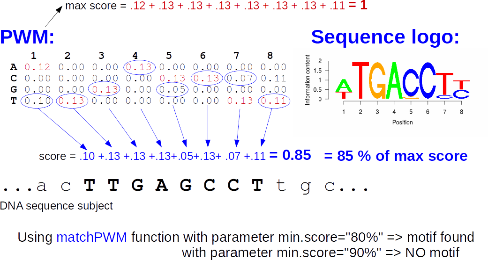
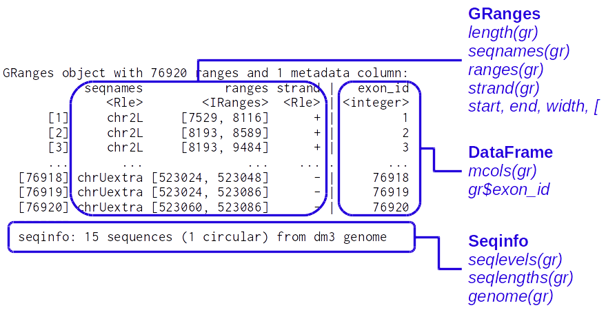
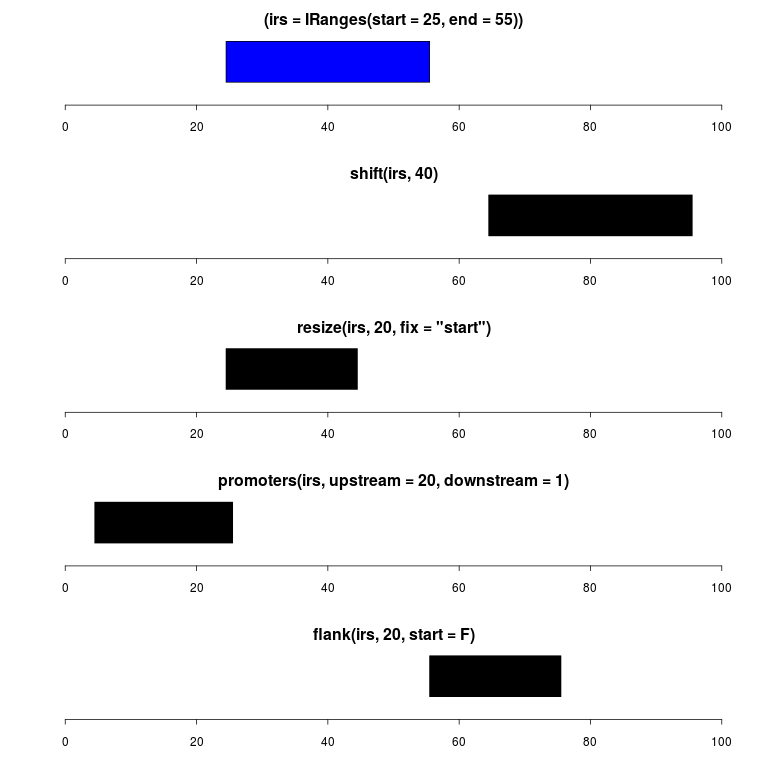
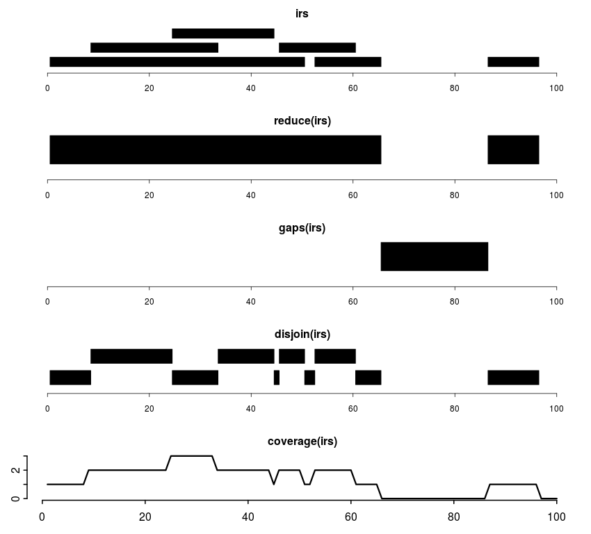
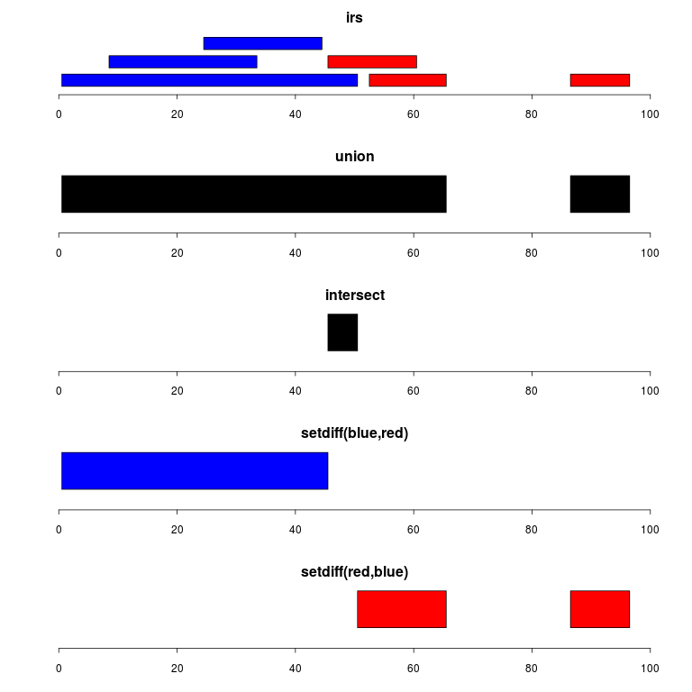
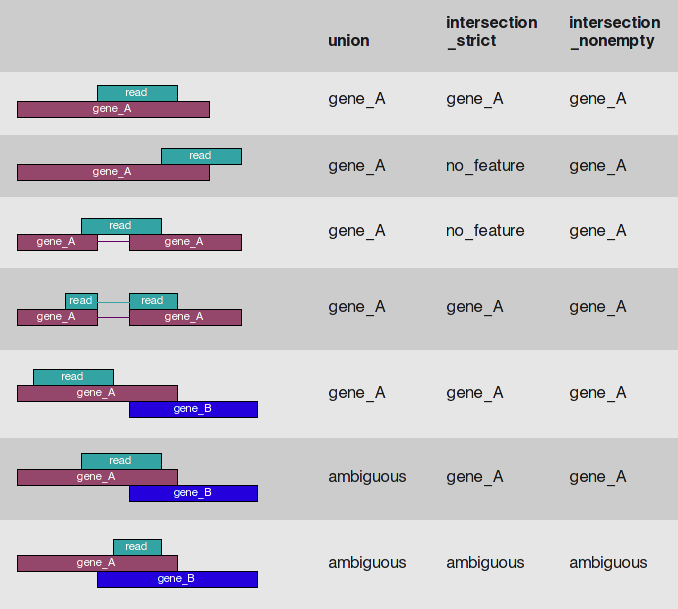
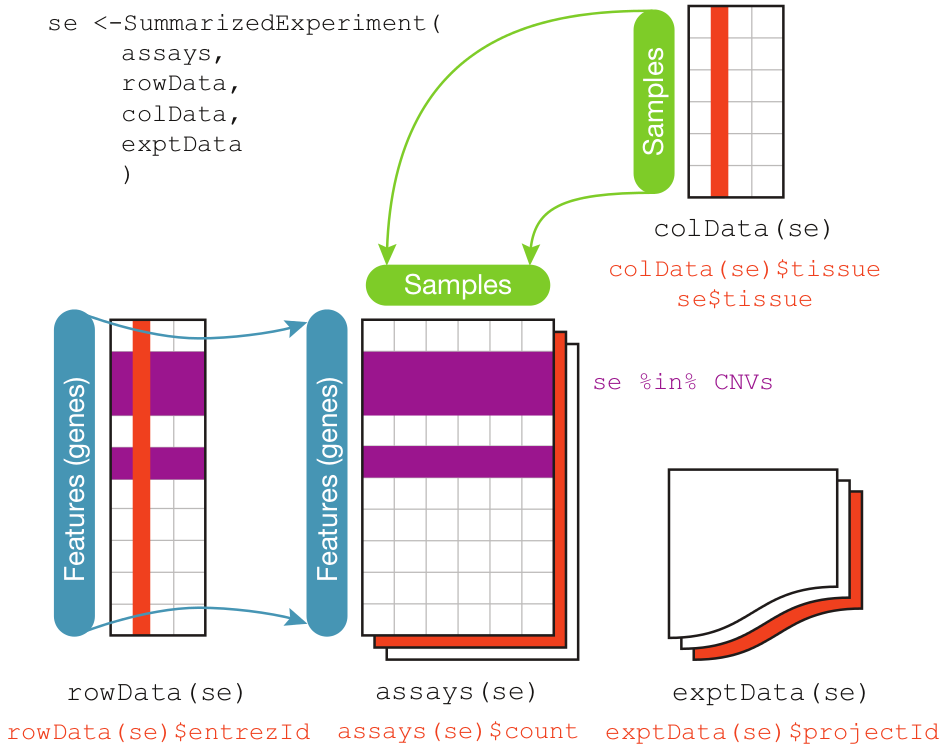
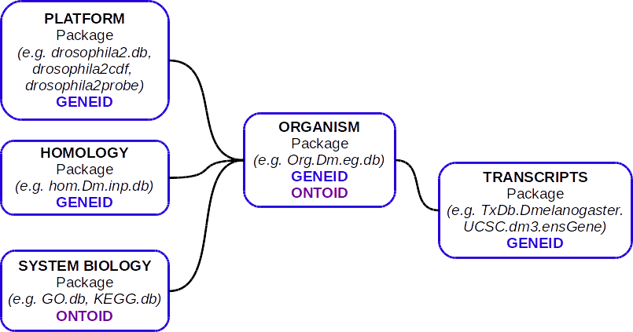
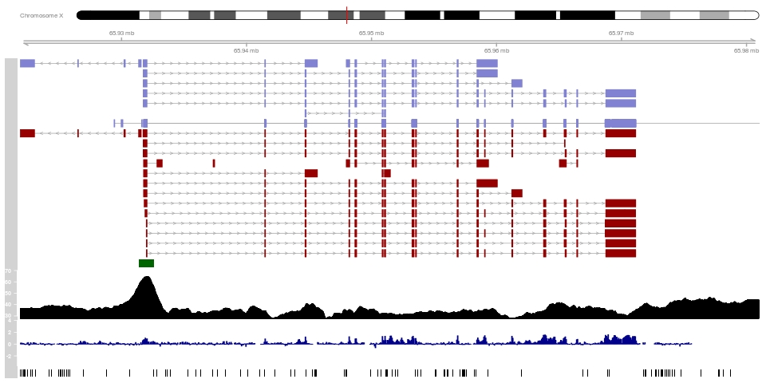

```{r setup, include=FALSE}
knitr::opts_chunk$set(echo = TRUE)
library(kableExtra)
```


# Outline

 1. What is NGS? Why BioC for NGS?
 2. Working with sequences
 3. Working with aligned reads
 4. Working with ranges
 5. Annotations
 6. Import / Export 
 7. Visualization


# Outline
 1. What is NGS? Why BioC for NGS?
 2. <span style="color:grey">Working with sequences</span>
 3. <span style="color:grey">Working with aligned reads</span>
 4. <span style="color:grey">Working with ranges</span>
 5. <span style="color:grey">Annotations</span>
 6. <span style="color:grey">Import / Export</span>
 7. <span style="color:grey">Visualization</span>


# NGS development


# NGS basics


# How does NGS work?
Illumina sequencing: bridge PCR (illustrations from [atdbio](https://www.atdbio.com/content/58/Next-generation-sequencing))


# Illumina sequencing
Illustrations from [NMBU](http://wiki.nmbu.org/index.php/Illumina_(Solexa)_sequencing)


# Other technologies?


# Increased throughput
... and decreased prices


# Bioconductor


# Bioconductor and the NGS workflow


# Bioconductor and the NGS workflow


# Specialized packages for about anything...
* RNA-seq / Differential expression analysis:  
    + <span style="color:chocolate">limma, DESeq2, edgeR, DEXseq, spliceR, rnaSeqMap, ...</span>
* ChIP-seq / peak finding / annotation:
    + <span style="color:chocolate">ChIPQC, chipseq, NarrowPeaks, DiffBind, MMDiff, epigenomix, jmosaics, csaw, ChIPseeker...</span>
* DNA methylation / DMR:
    + <span style="color:chocolate">bsseq, BiSeq, methylumi, minfi, Rnbeads, ...</span>
* 3C/4C/Hi-C/ChIA-PET / genomic interactions:
    + <span style="color:chocolate">r3Cseq, FourCSeq HiTC , GOTHiC, GenomicInterations, InteractionSet, ...</span>
* CAGE-seq: <span style="color:chocolate;font-size:80%"><i>TSSi, CAGEr, ...</i></span>
* DNAse-seq: <span style="color:chocolate;font-size:80%"><i>DNaseR, ...</i></span>
* MNase-seq: <span style="color:chocolate;font-size:80%"><i>PING, ...</i></span>
* ...   


# Outline
 1. <span style="color:grey">What is NGS? Why BioC for NGS?</span>
 2. Working with sequences
 3. <span style="color:grey">Working with aligned reads</span>
 4. <span style="color:grey">Working with ranges</span>
 5. <span style="color:grey">Annotations</span>
 6. <span style="color:grey">Import / Export</span>
 7. <span style="color:grey">Visualization</span>

# The fasta format


* Extension: .fa; .fasta  
<https://en.wikipedia.org/wiki/FASTA_format>


# Biostrings containers and accessors
```{r  warning=F,message=F}
library(Biostrings)
```

**Containers:**  

- XString – BString, DNAString, RNAString, AAString  
- XStringSet – multiple sequences  
- XStringViews  
  
*"Masked" sequences are also supported (see ?masks)*  
  

**Manipulation:**  

- [[ and [ for subsetting  
- subseq
- toString  
- Views  
...

# Importing sequences from a fasta file
```{r cache=T}
dm3_upstream_filepath <- system.file("extdata","dm3_upstream2000.fa.gz",
                                    package="Biostrings")
dm3_upstream <- readDNAStringSet(dm3_upstream_filepath)
dm3_upstream
dm3_upstream[[5]]
```


# Practice with your own DNA sequence  
  
Like `LETTERS` in base R, the [Biostrings](http://bioconductor.org/packages/release/bioc/html/Biostrings.html) package provides a `DNA_ALPHABET`.  
  
  
- Use it to create a  `DNAString`  object containing a random sequence of length 50.
- Get the reverse complement of this sequence
- Calculate the frequency of each A, T, G and C in your sequence.
- Calculate the GC% of your sequence
- Extract the nucleotides between 11 and 20.
- Convert the sequence to a character string
- Extract the first 5 bases every 10 bases

_Note that masks can also be associated to Biostrings and BSgenome objects_


# Working with large fasta files
The [Rsamtools](http://bioconductor.org/packages/release/bioc/html/Rsamtools.html) package provides function to work with large fasta file(s).  
The <span style="color:blue">FaFile</span> function creates a reference to an indexed fasta file (see `?FaFile`).  

This is particularly useful to extract sequences within a fasta file:

```{r, cache=TRUE, warning=F, message=F}
library(Rsamtools)
fl <- system.file("extdata", "ce2dict1.fa", package="Rsamtools",
                  mustWork=TRUE)
fa <- open(FaFile(fl))
seqinfo(fa)

getSeq(fa, GRanges("pattern05:11-20"))
```


# Whole genome sequences in BSgenome packages
```{r  warning=F,message=F}
library(BSgenome.Dmelanogaster.UCSC.dm3)
```

```{r cache=T}
names(Dmelanogaster)[1:5]
Dmelanogaster$chr2L
```


For a masked version of the genome, see:
```{r eval=F}
library(BSgenome.Dmelanogaster.UCSC.dm3.masked)
```


For adding SNPs info see:
```{r eval=F}
library(BSgenome)
?available.SNPs
```


# Pattern matching


```{r cache=T}
matchPattern("KATCGATA", dm3_upstream[[592]], fixed=FALSE)
```
*K is G or T, see [IUPAC code](http://www.bioinformatics.org/sms/iupac.html)* 
  
Other functions to search for patterns: <span style="color:blue">matchProbePair, findPalindromes, ...</span>

```{r eval=F}
vmatchPattern('TATCGATA', Dmelanogaster)
```

# Position weight matrix (PWM)
Probabilistic description of short sequences largely used for TF binding sites  
```{r,echo=F,warning=F,message=F}
library(MotifDb);library(seqLogo)
```
Get a motif (as a PFM):
```{r cache=T}
EcRMotif <- MotifDb::query(MotifDb,"EcR")[1]
```

<div class="col2-left">
seqLogo representation:  
```{r echo=F,cache=T,fig.height=4,fig.width=6,fig.align='center'}
seqLogo::seqLogo(reverseComplement(EcRMotif[[1]]))
```
  
</div>

<div class="col2-right">
  Convert to PWM:
```{r}
EcRpfm <- apply(reverseComplement(EcRMotif[[1]]) *
                    as.integer(mcols(EcRMotif)$sequenceCount),
                2, as.integer)
rownames(EcRpfm) <- rownames(EcRMotif[[1]])
EcRpwm <- PWM(EcRpfm)
```

```{r, echo=FALSE}
knitr::kable(EcRpwm,
             digits = rep(2,8),
             caption="PWM for EcR motif") %>%
    kable_styling(bootstrap_options = c("striped","condensed"),
                  full_width = FALSE,
                  font_size=14, position="center")
```
</div>


# Scanning a sequence with a PWM




# Scanning a sequence with a PWM

Search the motif in chr4 ('+' strand only):
```{r warning=F,cache=T}
EcRHits <- matchPWM(EcRpwm, Dmelanogaster$chr4)
length(EcRHits)
EcRHits[1:2]
```
For minus strand: use the <span style="color:blue">reverseComplement</span> of PWM

# Motif pipeline example
A typical pipeline:  
  
- Find a set of ChIP-seq peaks for a TF as a bed file (eg. [ENCODE](https://www.encodeproject.org/) or [modENCODE](http://www.modencode.org/).  
  
- Use a de novo motif search to identify enriched motifs (e.g. [RSAT](http://pedagogix-tagc.univ-mrs.fr/rsat/RSAT_portal.html), [MEME](http://meme-suite.org/), [BaMM motif](https://bammmotif.mpibpc.mpg.de/), R packages [rGADEM](http://bioconductor.org/packages/release/bioc/html/rGADEM.html) or [BCRANK](http://bioconductor.org/packages/release/bioc/html/BCRANK.html))  
  
- Get a PFM or PWM from the results. Convert as PWM if necessary.
  
- Scan the genome with the PWM (background frequencies!) 
  
- Annotate the identified motif location (TSS? enhancers? near specific groups of genes? etc.)  
  
- ...  

# More sequence tools:

**Other packages to work with motifs:**  
- [MotifDb](http://bioconductor.org/packages/release/bioc/html/MotifDb.html)  
- [seqLogo](http://bioconductor.org/packages/release/bioc/html/seqLogo.html)  
- [TFBSTools](http://bioconductor.org/packages/release/bioc/html/TFBSTools.html)  
- [rGADEM](http://bioconductor.org/packages/release/bioc/html/rGADEM.html)  
- [PWMEnrich](http://bioconductor.org/packages/release/bioc/html/PWMEnrich.html)  
- [BCRANK](http://bioconductor.org/packages/release/bioc/html/BCRANK.html)  
- [MotIV](http://bioconductor.org/packages/release/bioc/html/MotIV.html)  
- ...  

**For database queries (+ other tools for AA sequences):**  
[seqinr](https://cran.r-project.org/package=seqinr)  

# Sequence alignment

<span style="color:blue">pairwiseAlignment</span> is the core function:
```{r, cache=T}
pairwiseAlignment('CTTGCAGTGGTGTATTCATAC',
                  dm3_upstream[[1]],
                  type='global-local')
```

Levensthein edit distance:
```{r}
stringDist(c("lazy", "HaZy", "crAzY"))
stringDist(c("lazy", "HaZy", "crAzY"), ignoreCase = TRUE)
```


# Exercise: compare indexes
Consider a sequencing run with 10 multiplexed samples. We have the following 16 indexes available.  

```{r}
indx <- DNAStringSet( c("ATCACG", "CGATGT", "TTAGGC", "TGACCA",
                        "ACAGTG", "GCCAAT", "CAGATC", "ACTTGA",
                        "GATCAG", "TAGCTT", "GGCTAC", "CTTGTA",
                        "CGGCTA", "TCCGCG", "ATGTCA", "AGCGAT"))
```

- Use the `stringDist` function to compare these indexes and choose the 10 "best" indexes 
- Evaluate if all 4 bases are sequenced at each sequencing cycles (use the `consensusMatrix` function)


# Fastq format
* Extension: .fq; .fastq <https://en.wikipedia.org/wiki/FASTQ_format>

  

$Q = -10*{\log_{10}(P)}$ <=> $P = 10^{-\frac{Q}{10}}$


# Working with fastq files
The [ShortRead](http://bioconductor.org/packages/release/bioc/html/ShortRead.html) package <span class="citeref">[@pmid19654119]</span>
```{r echo=FALSE, warning=F,message=F}
library(ShortRead)
```

Import a fastq file with 20K reads:
```{r cache=T}
fq1_path <- system.file(package="ShortRead","extdata","E-MTAB-1147",
                        "ERR127302_1_subset.fastq.gz")
myFastq <- readFastq(fq1_path)
```

Explore with:
```{r}
myFastq
myFastq[1:3]
```


# Working with fastq files
```{r}
head(sread(myFastq), 2)
head(quality(myFastq), 2)
head(id(myFastq), 2)
encoding(quality(myFastq))[seq(1,51,by=2)]
alphabet(sread(myFastq))[1:4]
```


# Large fastq files
Functions <span style="color:blue">FastqSampler</span> and <span style="color:blue">FastqStreamer</span>  
Count the reads in a fastq file:
```{r, cache=T}
nr_myFastq <- 0
strm <- FastqStreamer(fq1_path,1000)
repeat {
 ## Get FASTQ chunk:
  fq <- yield(strm)
  if (length(fq) == 0)
   break
 ## Do something on the chunk:
  nr_myFastq <- nr_myFastq + length(fq)
}
close(strm) #close the connection
nr_myFastq
```


# QC on fastq files
[fastqc](http://www.bioinformatics.babraham.ac.uk/projects/fastqc/) from Babraham  

Several tools available in R/BioC: [ShortRead](http://bioconductor.org/packages/release/bioc/html/ShortRead.html) <span style="color:blue">qa</span>/<span style="color:blue">qa2</span> functions, [qrqc](http://bioconductor.org/packages/release/bioc/html/qrqc.html), [seqTools](http://bioconductor.org/packages/release/bioc/html/seqTools.html), [Rqc](http://bioconductor.org/packages/release/bioc/html/Rqc.html)  

Run `library(Rqc)` on a fastq file:
```{r cache=T}
rqcResultSet <- rqcQA(fq1_path, sample=TRUE)
```
  
<div class="col2-left">  
  
```{r cache=T, warning=F, out.width="500px", out.height="350px", fig.align='center'}
rqcCycleQualityPlot(rqcResultSet)
```
  
</div>
  
<div class="col2-right">  
  
```{r cache=T, warning=F, out.width="500px", out.height="350px", fig.align='center'}
rqcCycleBaseCallsLinePlot(rqcResultSet)
```
  
</div>


# Filtering a fastq file

Define some filters:
```{r cache=T}
max1N <- nFilter(threshold=1L) #No 'Ns' in the reads
goodq <- srFilter(function(x){apply(as(quality(x),"matrix"),
                            1,median,na.rm=T)>=30},
                 name="MedianQualityAbove30")
myFilter <- compose(max1N,goodq) #combine filters
```

# Filtering a fastq file

Create a function to filter and trim the reads:
```{r cache=T}
FilterAndTrim <- function(fl,destination=sprintf("%s_filtered",fl))
{
  stream <- FastqStreamer(fl) ## open input stream
  on.exit(close(stream))
  repeat {
    ###get fastq chunk  
    fq <- yield(stream)
    if (length(fq)==0)
      break
    ###TRIM first 4 and last 2 bases
    fq <- narrow(fq,start=5,end=70)
    ###FILTER
    fq <- fq[myFilter(fq)]
    ###write filtered fastq
    writeFastq(fq, destination, mode="a")
  }
}
```

Apply the function:
```{r eval=F}
FilterAndTrim(fqFiles[1],
              destination=file.path(getwd(),"FilteredFastq.fq"))
```


# Outline
 1. <span style="color:grey">What is NGS? Why BioC for NGS?</span>
 2. <span style="color:grey">Working with sequences</span>
 3. Working with aligned reads
 4. <span style="color:grey">Working with ranges</span>
 5. <span style="color:grey">Annotations</span>
 6. <span style="color:grey">Import / Export</span>
 7. <span style="color:grey">Visualization</span>


# Alignment of NGS reads
R packages: [Rbowtie](http://bioconductor.org/packages/release/bioc/html/Rbowtie.html), [Rbowtie2](http://bioconductor.org/packages/release/bioc/html/Rbowtie2.html), [QuasR](http://bioconductor.org/packages/release/bioc/html/QuasR.html) <span class="citeref">[@pmid25417205]</span>, [Rsubread](http://bioconductor.org/packages/release/bioc/html/Rsubread.html) <span class="citeref">[@pmid23558742; @pmid24227677]</span>  
  
__[Mapping quality](http://genome.sph.umich.edu/wiki/Mapping_Quality_Scores) scores__ <span class="citeref">[MAQ aligner in @pmid18714091]</span>:  
- base qualities (Phred scores)  
- mismatches/indels  
- repetitions  
- paired reads  

* __Aligning unspliced reads:__  
     + [Bowtie](http://bowtie-bio.sourceforge.net/index.shtml) <span class="citeref">[@pmid19261174]</span> / [Bowtie2](http://bowtie-bio.sourceforge.net/bowtie2/index.shtml) <span class="citeref">[@pmid22388286]</span>; [BWA](http://bio-bwa.sourceforge.net/) <span class="citeref">[@pmid19451168; @pmid20080505]</span>; [GEM mapper](http://algorithms.cnag.cat/wiki/The_GEM_library) <span class="citeref">[@pmid23103880]</span>  
  
* __Aligning spliced reads__  
     + [TopHat2](http://ccb.jhu.edu/software/tophat/index.shtml) <span class="citeref">[@pmid19289445; @pmid23618408]</span> / [HISAT2](http://ccb.jhu.edu/software/hisat2/index.shtml) <span class="citeref">[@pmid25751142]</span>; [MapSplice](http://www.netlab.uky.edu/p/bioinfo/MapSplice) <span class="citeref">[@pmid20802226]</span>; [STAR](https://github.com/alexdobin/STAR) <span class="citeref">[@pmid23104886]</span>  


See also [Wikipedia's list of alignment tools](https://en.wikipedia.org/wiki/List_of_sequence_alignment_software)  


# SAM/BAM format


[SAM format specifications](https://github.com/samtools/hts-specs)  
Useful tools: [samtools](http://www.htslib.org/), [Picard tools](http://broadinstitute.github.io/picard/)


# BAM file import

```{r}
library(Rsamtools);library(GenomicAlignments)
library(pasillaBamSubset)
sr <- untreated1_chr4() #single-end
pr <- untreated3_chr4() #paired-end
```

Use samtools to index the file
```{r eval=F}
indexBam(sr_bamFile)
```

All functions from [samtools](http://www.htslib.org/) are available with R (e.g. <span style="color:blue">sortBam</span>, <span style="color:blue">countBam</span>, <span style="color:blue">filterBam</span>, <span style="color:blue">mergeBam</span>, etc.)


# BAM file import

Define what to import
```{r cache=T}
which=GRanges(seqnames="chr4",
              ranges=IRanges(c(75000,1190000),
                             c(85000,1203000)),
              strand="*")
what = c("rname","strand","pos","qwidth","seq")
flag=scanBamFlag(isDuplicate=FALSE)
param=ScanBamParam(which=which,what=what,flag=flag)
```


# Import single-end reads
```{r cache=T}
srbam <- readGAlignments(sr,param=param)
srbam[1:2]
```

# Import paired-end reads
```{r warning=F, cache=T}
prbam <- readGAlignmentPairs(pr)
prbam[1:2]
```

There is also a <span style="color:blue">BamFile</span> function to create a reference to a large BAM file without importing it (as for <span style="color:blue">FaFile</span>).  
See also the [GenomicFiles](http://bioconductor.org/packages/release/bioc/html/GenomicFiles.html) package for working on many, large files

# Outline
 1. <span style="color:grey">What is NGS? Why BioC for NGS?</span>
 2. <span style="color:grey">Working with sequences</span>
 3. <span style="color:grey">Working with aligned reads</span>
 4. Working with ranges
 5. <span style="color:grey">Annotations</span>
 6. <span style="color:grey">Import / Export</span>
 7. <span style="color:grey">Visualization</span>


# Working with genomic ranges

Packages [IRanges](http://bioconductor.org/packages/release/bioc/html/IRanges.html) & [GenomicRanges](http://bioconductor.org/packages/release/bioc/html/GenomicRanges.html) <span class="citeref">[@pmid23950696]</span>  
See also the [Introduction by Martin Morgan, 2014](http://master.bioconductor.org/help/course-materials/2014/SeattleFeb2014/Ranges_slides.pdf)  

- __Importance of range concept__
    + Genomic data and annotations can be represented by ranges
    + Many biological questions correspond to queries on ranges:
        - How many reads overlap each gene / exon / splice junction?
        - Where does my protein bind in ChiP-seq experiment?
        - How many of my peaks overlap with promoters?
      
      
- __Where do range-like objects come from?__
    + DATA (e.g. BAM, BED, WIG files,...)
    + ANNOTATIONS (BED, GFF/GTF, TxDb*, AnnotationHub,...)


# IRanges Definition
- __What is an IRange?__
    + 2 vectors out of 'start', 'end' and 'width' (SEW ; $end = start + width - 1$)
    + closed intervals (i.e. include end points)
    + zero-width convention: $width \geq 0$ ; $end=start-1 \Leftrightarrow width=0$
    + can be named

A simple IRanges:
```{r cache=T}
eg = IRanges(start = c(1, 10, 20),
              end = c(4, 10, 19),
              names = c("A", "B", "C"))
eg
```


# IRanges 

A bigger IRanges:  
```{r cache=T}
set.seed(123) #For reproducibility
start = floor(runif(10000, 1, 1000))
width = floor(runif(10000, 0, 100))
ir = IRanges(start, width=width)
ir
```


# IRanges 

Vector-like behavior: _length, [_  
Accessors: _start, end, width, names_  

```{r cache=T}
length(ir)
width(ir[1:4])
names(eg)
```


# IRanges 

Some useful functions:
```{r}
mid(ir[1:4])
successiveIRanges(width=rep(10,3),gap=10)
tile(ir[1:2],n=2)
```


# IRangesList - List objects

```{r}
irl  <- split(ir,width(ir)) # an IRangesList
irl[[1]][1:3]
length(irl)
head(elementNROWS(irl))
```

# S4Vectors List objects
List = list with all elements of the same type. See `?List`
```{r}
start(irl)[1:2]
log(start(irl)[1:2])
```

# Genomic ranges
- __GRanges builds on IRanges__
    + 'seqnames' (typically chromosomes) and 'strand' ('+', '-' or '*')
    + (optional) 'seqinfo' for genome information
    + (optional) 'mcols' for 'metadata' data frame on each range

- __Genome coordinates__
    + [1-based](https://www.biostars.org/p/84686/)
    + 'left-most' ('start' of ranges on the 'minus' strand are the left-most coordinate, rather than the 5' coordinate)  

Package [GenomicRanges](http://bioconductor.org/packages/release/bioc/html/GenomicRanges.html):
```{r}
library(GenomicRanges)
```


# GRanges  
A typical use case:
```{r echo=FALSE}
options(showHeadLines=3)
options(showTailLines=3)
```
```{r warning=F, message=F}
library(TxDb.Dmelanogaster.UCSC.dm3.ensGene)
txdb <- TxDb.Dmelanogaster.UCSC.dm3.ensGene
(gr <- exons(txdb))
```


# GRanges


<br/>

Operations on GRanges are generally _seqnames-aware_ and _strand-aware_ (see argument `ignore.strand`)


# GRangesList
```{r cache=T}
(grl <- exonsBy(txdb,by="gene"))
```

# Intra-ranges operations

See `?'intra-range-methods'`

```{r echo=F, eval=F}
#plotRange function
plotRanges <- function(x, xlim = x, main = deparse(substitute(x)),
col = "black", sep = 0.5, cextitle=1, cexaxis=1, xaxis=T,...)
{
height <- 1
if (is(xlim, "Ranges"))
xlim <- c(min(start(xlim)), max(end(xlim)))
bins <- disjointBins(IRanges(start(x), end(x) + 1))
plot.new()
plot.window(xlim, c(0, max(bins)*(height + sep)))
ybottom <- bins * (sep + height) - height
rect(start(x)-0.5, ybottom, end(x)+0.5, ybottom + height, col = col, ...)
if (xaxis)
(axis(1,cex.axis=cexaxis,padj=1))
title(main,cex.main=cextitle)
}
```


```{r echo=F,eval=F}
png("./figs/RangesOperations_intraRange.png",
     width = 768, height = 768,res=72)
par(mfrow=c(5,1))
plotRanges((irs=IRanges(start=25,end=55)),xlim=c(0,100),xaxis=T, cextitle=2, cexaxis=1.5,col=rep(c("blue","red"),each=3))
plotRanges(shift(irs,40),xlim=c(0,100),xaxis=T, cextitle=2, cexaxis=1.5)
plotRanges(resize(irs,20,fix="start"),xlim=c(0,100),xaxis=T, cextitle=2, cexaxis=1.5)
plotRanges(promoters(irs,upstream=20,downstream=1),xlim=c(0,100),xaxis=T, cextitle=2, cexaxis=1.5)
plotRanges(flank(irs,20,start=F),xlim=c(0,100),xaxis=T, cextitle=2, cexaxis=1.5)
dev.off()

```


<br/>
Also <span style="color:blue">reflect</span>, <span style="color:blue">narrow</span> and <span style="color:blue">threebands</span>, <span style="color:blue">restrict</span> and <span style="color:blue">trim</span>


# Inter-ranges operations

See `?'inter-range-methods'`
```{r, echo=F, eval=F}
#Create irs
irs = IRanges(start=c(1,9,25,46,53,87),
              end=c(50,33,44,60,65,96))
#Plot irs
png("./figs/RangesOperations.png",
     width = 850, height = 768,res=72)
par(mfrow=c(5,1))
plotRanges(irs,xlim=c(0,100),xaxis=T, cextitle=2, cexaxis=1.5)
plotRanges(reduce(irs),xlim=c(0,100),xaxis=T, cextitle=2, cexaxis=1.5)
plotRanges(gaps(irs),xlim=c(0,100),xaxis=T, cextitle=2, cexaxis=1.5)
plotRanges(disjoin(irs),xlim=c(0,100),xaxis=T, cextitle=2, cexaxis=1.5)
plot(1:100,c(coverage(irs),rep(0,4)),type="l",axes=F,xlab="",ylab="",lwd=3)
title(main="coverage(irs)",cex.main=2)
axis(side=2,lwd=2,cex.axis=2,at=0:3,labels=0:3)
axis(1,lwd=2,cex.axis=2,padj=1)
dev.off()
```




# Set operations - Nearest methods

See `?'setops-methods'`
```{r echo=F,eval=F}
png("./figs/RangesOperations_setops.png",
     width = 768, height = 768,res=72)
par(mfrow=c(5,1))
plotRanges(irs,xlim=c(0,100),xaxis=T, cextitle=2, cexaxis=1.5,col=rep(c("blue","red"),each=3))
plotRanges(union(irs[1:3],irs[4:6]),xlim=c(0,100),xaxis=T, cextitle=2, cexaxis=1.5,main="union")
plotRanges(intersect(irs[1:3],irs[4:6]),xlim=c(0,100),xaxis=T, cextitle=2, cexaxis=1.5,main="intersect")
plotRanges(setdiff(irs[1:3],irs[4:6]),xlim=c(0,100),xaxis=T, cextitle=2, cexaxis=1.5,col="blue",main="setdiff(blue,red)")
plotRanges(setdiff(irs[4:6],irs[1:3]),xlim=c(0,100),xaxis=T, cextitle=2, cexaxis=1.5,col="red",main="setdiff(red,blue)")
dev.off()

```


<br/>
See also `?'nearest-methods'` including <span style="color:blue">nearest</span>, <span style="color:blue">precede</span>, <span style="color:blue">follow</span> and <span style="color:blue">distance</span>,


# Between-range operations / Overlaps

_Q: Number of TSS located at >500bp from another gene?_  

Get all genes and transcrits:
```{r cache=T}
Dmg <- genes(txdb) 
Dmt <- transcriptsBy(txdb,by="gene")
```
Get all TSS:
```{r cache=T}
Dm_tss <- unlist(reduce(promoters(Dmt,up=0,down=1),min.gap=0L))
```

Proportion of TSS overlapping with more than 1 gene +/- 500bp:
```{r  cache=T,warning=F}
mean(countOverlaps(Dm_tss,Dmg+500) > 1) #!strand-aware
mean(countOverlaps(Dm_tss,Dmg+500,ignore.strand=T) > 1)
```


# Overlaps  

Obtaining the overlaps:  
```{r cache=T, warning=F}
fov <- findOverlaps(Dm_tss,Dmg+500,ignore.strand=T) ; fov[1:3]
```
Two genes on opposite strands that are overlapping:
```{r cache=T}
Dmg[subjectHits(fov)[queryHits(fov)==1]]
```

_Q: How many reads in srbam overlap with gene FBgn0002521?_  
```{r cache=T}
length(subsetByOverlaps(srbam,Dmg["FBgn0002521"]))
```

_Q: How many reads in srbam overlap with exons of FBgn0002521?_  
```{r cache=T}
length(srbam[overlapsAny(srbam,grl[["FBgn0002521"]])])
```


# Counting reads mapping on features  

Reads mapping on exons:
```{r cache=T}
ctex <- summarizeOverlaps(features = grl[seqnames(Dmg)=="chr4"],
                             reads = srbam,
                              mode = Union)
```



```{r cache=T}
head(assays(ctex)$counts)
```


# SummarizedExperiment
<span class="citeref">[@pmid25633503]</span>



# Rle

```{r cache=T}
srbam <- readGAlignments(sr)
(covr <- coverage(srbam))
```

# Average profile on gene bodies
Genes on chromosome 4:
```{r cache=T}
gn4 <- Dmg[seqnames(Dmg)=="chr4"]
```

Extract gene level profiles:
```{r cache=T}
profgn4 <- covr[gn4]
profgn4[strand(gn4)=="-"] <- lapply(profgn4[strand(gn4)=="-"],rev)
names(profgn4) <- names(gn4) ; profgn4[1:2]
```

Extract the first 1Kb as a matrix:
```{r cache=T}
profgn4 <- profgn4[elementNROWS(profgn4)>=1000]
profgn4 <- as(lapply(profgn4,window,1,1000),"RleList")
mat1kb <- matrix(as.numeric(unlist(profgn4, use.names=F)),
                 nrow=length(profgn4), byrow=T,
                 dimnames=list(names(profgn4),NULL))
mat1kb <- mat1kb[rowSums(mat1kb)>0,]
```
  
  
# Average profile on gene bodies

Plot the average profile:
```{r cache=T}
df1Kb <- data.frame(Coordinate=1:1000,
                    Coverage=apply(mat1kb,2,mean,na.rm=T,trim=0.03))
ggplot(df1Kb,aes(x=Coordinate,y=Coverage))+
  geom_line()
```


# Extract sequences in a BSgenome using a GRanges
```{r  cache=T}
getSeq(Dmelanogaster,gn4[1:2])
Views(Dmelanogaster,gn4[1:2])
```


# Outline
 1. <span style="color:grey">What is NGS? Why BioC for NGS?</span>
 2. <span style="color:grey">Working with sequences</span>
 3. <span style="color:grey">Working with aligned reads</span>
 4. <span style="color:grey">Working with ranges</span>
 5. Annotations
 6. <span style="color:grey">Import / Export</span>
 7. <span style="color:grey">Visualization</span>

# Annotations

```{r echo=F,message=F,warning=F}
library(org.Dm.eg.db)
```

# Annotations

- __[AnnotationDBi](http://bioconductor.org/packages/release/bioc/html/AnnotationDbi.html)__  
    + select
    + keys / keytype
    + columns
```{r message=F}
select(org.Dm.eg.db,
       keys=c('FBgn0015664','FBgn0015602'),keytype="FLYBASE",
       columns=c('SYMBOL','UNIGENE','ENTREZID','FLYBASECG'))
```

- __[GenomicFeatures](http://bioconductor.org/packages/release/bioc/html/GenomicFeatures.html)__: build and manipulate TxDb  
- __[OrganismDbi](http://bioconductor.org/packages/release/bioc/html/OrganismDbi.html)__ : Human, Mouse, Rat ([BiocView](http://bioconductor.org/packages/release/BiocViews.html#___OrganismDb))  


# AnnotationHub

- __[AnnotationHub](http://bioconductor.org/packages/release/bioc/html/AnnotationHub.html)__

```{r eval=F}
library(AnnotationHub)
hub <- AnnotationHub()
length(hub) # >43500 datasets
unique(hub$dataprovider)
head(unique(hub$species))
head(unique(ah$rdataclass))
```

   + Data from ENCODE, EpigenomeRoadMap, 1000 Genomes project, Ensembl, NCBI, Inparanoid8, dbSNP,...    
   + Screen datasets from large projects
   + liftOver files
   + Assemblies and annotation files for non-model organisms
   + ...


# Outline
 1. <span style="color:grey">What is NGS? Why BioC for NGS?</span>
 2. <span style="color:grey">Working with sequences</span>
 3. <span style="color:grey">Working with aligned reads</span>
 4. <span style="color:grey">Working with ranges</span>
 5. <span style="color:grey">Annotations</span>
 6. Import / Export
 7. <span style="color:grey">Visualization</span>


# Import/Export

- __[rtracklayer](http://bioconductor.org/packages/release/bioc/html/rtracklayer.html)__ <span class="citeref">[@pmid19468054]</span>  
    + import/export of track data (GFF, BED, WIG, bedGraph, BigWig)
    + interface to UCSC [genome browser](http://genome.ucsc.edu/cgi-bin/hgTracks) and [table browser](http://genome.ucsc.edu/cgi-bin/hgTables)

- __[SRAdb](http://bioconductor.org/packages/release/bioc/html/SRAdb.html)__ <span class="citeref">[@pmid23323543]</span>  
    + browse and interact with NCBI's [Short Read Archive](http://www.ncbi.nlm.nih.gov/sra)
    + interface with [IGV](http://www.broadinstitute.org/igv/)     

- __[biomaRt](http://bioconductor.org/packages/release/bioc/html/biomaRt.html)__ <span class="citeref">[@pmid19617889;@pmid16082012]</span>   
    + interface to [Biomart](http://www.biomart.org/) databases  

- __[GEOquery](http://bioconductor.org/packages/release/bioc/html/GEOquery.html)__ <span class="citeref">[@pmid17496320]</span>     
    + interface to NCBI [GEO](http://www.ncbi.nlm.nih.gov/geo/)  


# Outline
 1. <span style="color:grey">What is NGS? Why BioC for NGS?</span>
 2. <span style="color:grey">Working with sequences</span>
 3. <span style="color:grey">Working with aligned reads</span>
 4. <span style="color:grey">Working with ranges</span>
 5. <span style="color:grey">Annotations</span>
 6. <span style="color:grey">Import / Export</span>
 7. Visualization


# Visualization

- Genome browser-type: [Gviz](https://bioconductor.org/packages/release/bioc/html/Gviz.html), [ggbio](https://bioconductor.org/packages/release/bioc/html/ggbio.html), [Sushi](https://www.bioconductor.org/packages/release/bioc/html/Sushi.html)  
- More specialized packages: [gtrellis](https://bioconductor.org/packages/release/bioc/html/gtrellis.html), [GenVisR](https://bioconductor.org/packages/release/bioc/html/GenVisR.html), [OmicCircos](https://bioconductor.org/packages/release/bioc/html/OmicCircos.html), [circlize](https://cran.r-project.org/web/packages/circlize/index.html), [EnrichedHeatmap](http://bioconductor.org/packages/release/bioc/html/EnrichedHeatmap.html),...  





# Conclusions
<br/>
<br/>
   
- A solid infrastructure for analyzing all kinds of NGS data  
- Efficient manipulation of large strings/ranges/vectors and sets of  
- Active development and most recent advances in analysis methods  
- Large and active community provides support and updates  
- Great functions for data summaries and graphical displays - ideal for exploratory analyses  
- Large projects also have their solutions ([BiocParrallel](http://bioconductor.org/packages/release/bioc/html/BiocParallel.html), [GenomicFiles](http://bioconductor.org/packages/release/bioc/html/GenomicFiles.html), [h5vc](http://bioconductor.org/packages/release/bioc/html/h5vc.html),...; see <span class="citeref">[@scalabgeno;@pmid24451629]</span>)  


# Other useful resources
<br/>
<br/>
    
- Bioconductor [courses & conferences](http://bioconductor.org/help/course-materials/)
- Bioconductor [workflows](http://bioconductor.org/help/workflows/)
- [BiocViews](http://bioconductor.org/packages/release/BiocViews.html#___Software) & Package vignettes
- Bioconductor articles & books
- [Stackoverflow](http://stackoverflow.com/), [Biostars](https://www.biostars.org/), [SEQanswers](http://seqanswers.com/),...


# Major Bioconductor contributors

<br/>
<br/>
   
- Michael Lawrence, Genentech Research and Early Development, USA.  
- Martin Morgan, Roswell Park Cancer Institute, USA.
- Valerie Obenchain, Roswell Park Cancer Institute, USA.
- Hervé Pagès, Fred Hutchinson Cancer Research Center, USA.
- Patrick Aboyoun, Oracle, USA. 
<br/>
<br/>
<p style="font-size:150%;text-align:center;">[Bioconductor Core Team](http://bioconductor.org/about/core-team/)</p>

---------------------  

<br/>
<br/>
<br/>
<br/>
<p style="font-size:200%;text-align:center;color:blue">Thank you for your attention!</p>


# References {.referencePage}

