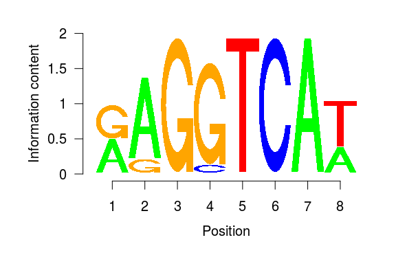

## Outline

 1. What is NGS? Why BioC for NGS?
 2. Working with sequences
 3. Working with aligned reads
 4. Working with ranges
 5. Annotations
 6. Import / Export 
 7. Visualization

## Outline
 1. What is NGS? Why BioC for NGS?
 2. <span style="color:grey">Working with sequences</span>
 3. <span style="color:grey">Working with aligned reads</span>
 4. <span style="color:grey">Working with ranges</span>
 5. <span style="color:grey">Annotations</span>
 6. <span style="color:grey">Import / Export</span>
 7. <span style="color:grey">Visualization</span>


## NGS development


## NGS basics


## How does NGS work?
Illumina sequencing: bridge PCR (illustrations from [atdbio](https://www.atdbio.com/content/58/Next-generation-sequencing))


## Illumina sequencing
Illustrations from [NMBU](http://wiki.nmbu.org/index.php/Illumina_(Solexa)_sequencing)


## Other technologies?


## Increased throughput
... and decreased prices


## Bioconductor


## Bioconductor and the NGS workflow


## Bioconductor and the NGS workflow


## Specialized packages for about anything...
* RNA-seq / Differential expression analysis:  
    + <span style="color:chocolate">limma, DESeq2, edgeR, DEXseq, spliceR, rnaSeqMap, ...</span>
* ChIP-seq / peak finding / annotation:
    + <span style="color:chocolate">ChIPQC, chipseq, NarrowPeaks, DiffBind, MMDiff, epigenomix, jmosaics, csaw, ChIPseeker...</span>
* DNA methylation / DMR:
    + <span style="color:chocolate">bsseq, BiSeq, methylumi, minfi, Rnbeads, ...</span>
* 3C/4C/Hi-C/ChIA-PET / genomic interactions:
    + <span style="color:chocolate">r3Cseq, FourCSeq HiTC , GOTHiC, GenomicInterations, InteractionSet, ...</span>
* CAGE-seq: <span style="color:chocolate;font-size:80%"><i>TSSi, CAGEr, ...</i></span>
* DNAse-seq: <span style="color:chocolate;font-size:80%"><i>DNaseR, ...</i></span>
* MNase-seq: <span style="color:chocolate;font-size:80%"><i>PING, ...</i></span>
* ...   


## Outline
 1. <span style="color:grey">What is NGS? Why BioC for NGS?</span>
 2. Working with sequences
 3. <span style="color:grey">Working with aligned reads</span>
 4. <span style="color:grey">Working with ranges</span>
 5. <span style="color:grey">Annotations</span>
 6. <span style="color:grey">Import / Export</span>
 7. <span style="color:grey">Visualization</span>

## The fasta format


* Extension: .fa; .fasta  
<https://en.wikipedia.org/wiki/FASTA_format>


## Biostrings containers and accessors

```r
library(Biostrings)
```

**Containers:**  

- XString – BString, DNAString, RNAString, AAString  
- XStringSet – multiple sequences  
- XStringViews  
  
*"Masked" sequences are also supported (see ?masks)*  
  
  

**Manipulation:**  

- [[ and [ for subsetting  
- subseq
- toString  
- Views  
...

## Importing sequences from a fasta file

```r
dm3_upstream_filepath <- system.file("extdata","dm3_upstream2000.fa.gz",
                                    package="Biostrings")
dm3_upstream <- readDNAStringSet(dm3_upstream_filepath)
dm3_upstream
```

```
##   A DNAStringSet instance of length 26454
##         width seq                                      names               
##     [1]  2000 GTTGGTGGCCCACCAGTGC...GTTTACCGGTTGCACGGT NM_078863_up_2000...
##     [2]  2000 TTATTTATGTAGGCGCCCG...CGGAAAGTCATCCTCGAT NM_001201794_up_2...
##     [3]  2000 TTATTTATGTAGGCGCCCG...CGGAAAGTCATCCTCGAT NM_001201795_up_2...
##     [4]  2000 TTATTTATGTAGGCGCCCG...CGGAAAGTCATCCTCGAT NM_001201796_up_2...
##     [5]  2000 TTATTTATGTAGGCGCCCG...CGGAAAGTCATCCTCGAT NM_001201797_up_2...
##     ...   ... ...
## [26450]  2000 ATTTACAAGACTAATAAAG...ATTAAATTTCAATAAAAC NM_001111010_up_2...
## [26451]  2000 GATATACGAAGGACGACCT...TTTGAGTTGTTATATATT NM_001015258_up_2...
## [26452]  2000 GATATACGAAGGACGACCT...TTTGAGTTGTTATATATT NM_001110997_up_2...
## [26453]  2000 GATATACGAAGGACGACCT...TTTGAGTTGTTATATATT NM_001276245_up_2...
## [26454]  2000 CGTATGTATTAGTTAACTC...AAGTGTAAGAACAAATTG NM_001015497_up_2...
```

```r
dm3_upstream[[5]]
```

```
##   2000-letter "DNAString" instance
## seq: TTATTTATGTAGGCGCCCGTTCCCGCAGCCAAAG...ATTAATCGATAGATACGGAAAGTCATCCTCGAT
```


## Working with your own DNA sequence  
  
Like `LETTERS` in base R, the [Biostrings](http://bioconductor.org/packages/release/bioc/html/Biostrings.html) package provides a `DNA_ALPHABET`.  
  
  
- Use it to create a  `DNAString`  object containing a random sequence of length 50.
- Get the reverse complement of this sequence
- Calculate the frequency of each A, T, G and C in your sequence.
- Calculate the GC% of your sequence
- Extract the nucleotides between 11 and 20.
- Convert the sequence to a character string
- Extract the first 5 bases every 10 bases

_Note that masks can also be associated to Biostrings and BSgenome objects_


## Working with large fasta files
The [Rsamtools](http://bioconductor.org/packages/release/bioc/html/Rsamtools.html) package provides function to work with large fasta file(s).  
The <span style="color:blue">FaFile</span> function creates a reference to an indexed fasta file (see `?FaFile`).  

This is particularly useful to extract sequences within a fasta file:


```r
library(Rsamtools)
fl <- system.file("extdata", "ce2dict1.fa", package="Rsamtools",
                  mustWork=TRUE)
fa <- open(FaFile(fl))
seqinfo(fa)
```

```
## Seqinfo object with 5 sequences from an unspecified genome:
##   seqnames  seqlengths isCircular genome
##   pattern01         18         NA   <NA>
##   pattern02         25         NA   <NA>
##   pattern03         24         NA   <NA>
##   pattern04         24         NA   <NA>
##   pattern05         25         NA   <NA>
```

```r
getSeq(fa, GRanges("pattern05:11-20"))
```

```
##   A DNAStringSet instance of length 1
##     width seq                                          names               
## [1]    10 TTTGGTGGTA                                   pattern05
```


## Whole genome sequences in BSgenome packages

```r
library(BSgenome.Dmelanogaster.UCSC.dm3)
```


```r
names(Dmelanogaster)[1:5]
```

```
## [1] "chr2L" "chr2R" "chr3L" "chr3R" "chr4"
```

```r
Dmelanogaster$chr2L
```

```
##   23011544-letter "DNAString" instance
## seq: CGACAATGCACGACAGAGGAAGCAGAACAGATAT...TATTTGCAAATTTTGATGAACCCCCCTTTCAAA
```


For a masked version of the genome, see:

```r
library(BSgenome.Dmelanogaster.UCSC.dm3.masked)
```


For adding SNPs info see:

```r
library(BSgenome)
?available.SNPs
```

## Pattern matching


```r
matchPattern("KATCGATA",dm3_upstream[[592]],fixed=F)
```

```
##   Views on a 2000-letter DNAString subject
## subject: TCCCAAATTAACTAATGGCTTTTCACGCAGAT...GCCTCACTTTTGTCCACATCTTTTGAAAGGC
## views:
##     start end width
## [1]    72  79     8 [GATCGATA]
## [2]   512 519     8 [TATCGATA]
## [3]   518 525     8 [TATCGATA]
```
*K is G or T, see [IUPAC code](http://www.bioinformatics.org/sms/iupac.html)* 
  
Other functions to search for patterns: <span style="color:blue">matchProbePair, findPalindromes, ...</span>


```r
vmatchPattern('TATCGATA',Dmelanogaster)
```

## Position weight matrix (PWM)
Probabilistic description of short sequences largely used for TF binding sites  


```r
EcRMotif <- MotifDb::query(MotifDb,"EcR")[[1]]
```

seqLogo representation:  



```r
EcRHits <- matchPWM(EcRMotif,Dmelanogaster$chr4)
length(EcRHits)
```

```
## [1] 1799
```

```r
EcRHits[1:2]
```

```
##   Views on a 1351857-letter DNAString subject
## subject: GAATTCGCGTCCGCTTACCCATGTGCCTGTGG...TAAAAGCAGCCGTCGATTTGAGATATATGAA
## views:
##     start  end width
## [1]  1135 1142     8 [ATGTCCTT]
## [2]  1630 1637     8 [TTCACCTT]
```

Minus strand: use the <span style="color:blue">reverseComplement</span> of PWM

## More sequence tools:

**Other packages to work with motifs:**  
- [MotifDb](http://bioconductor.org/packages/release/bioc/html/MotifDb.html)  
- [seqLogo](http://bioconductor.org/packages/release/bioc/html/seqLogo.html)  
- [PWMEnrich](http://bioconductor.org/packages/release/bioc/html/PWMEnrich.html)  
- [TFBSTools](http://bioconductor.org/packages/release/bioc/html/TFBSTools.html)  
- [rGADEM](http://bioconductor.org/packages/release/bioc/html/rGADEM.html)  
- [BCRANK](http://bioconductor.org/packages/release/bioc/html/BCRANK.html)  
- [MotIV](http://bioconductor.org/packages/release/bioc/html/MotIV.html)  
- ...  

**For database queries (+ other tools for AA sequences):**  
[seqinr](https://cran.r-project.org/package=seqinr)  

**Other functions:**

```r
pairwiseAlignment('CTTGCAGTGGTGTATTCATAC',dm3_upstream[[1]],type='global-local')
```

```
## Global-Local PairwiseAlignmentsSingleSubject (1 of 1)
## pattern:   [1] CTTGCAGTGG-TGTATTCATAC 
## subject: [713] CTTGCAGTGGGTGTAT--ATAC 
## score: 5.653368
```


## Fastq format
* Extension: .fq; .fastq <https://en.wikipedia.org/wiki/FASTQ_format>

  

$Q = -10*{\log_{10}(P)}$ <=> $P = 10^{-\frac{Q}{10}}$


## Working with fastq files
The [ShortRead](http://bioconductor.org/packages/release/bioc/html/ShortRead.html) package <span class="citeref">[@pmid19654119]</span>

```r
library(ShortRead)
```

Import a fastq file with 20K reads:

```r
fq1_path <- system.file(package="ShortRead","extdata","E-MTAB-1147",
                        "ERR127302_1_subset.fastq.gz")
myFastq <- readFastq(fq1_path)
```

Explore with:

```r
myFastq
```

```
## class: ShortReadQ
## length: 20000 reads; width: 72 cycles
```

```r
myFastq[1:5]
```

```
## class: ShortReadQ
## length: 5 reads; width: 72 cycles
```

----

```r
head(sread(myFastq), 2)
```

```
##   A DNAStringSet instance of length 2
##     width seq
## [1]    72 GTCTGCTGTATCTGTGTCGGCTGTCTCGCGG...CAATGAAGGCCTGGAATGTCACTACCCCCAG
## [2]    72 CTAGGGCAATCTTTGCAGCAATGAATGCCAA...GTGGCTTTTGAGGCCAGAGCAGACCTTCGGG
```

```r
head(quality(myFastq), 2)
```

```
## class: FastqQuality
## quality:
##   A BStringSet instance of length 2
##     width seq
## [1]    72 HHHHHHHHHHHHHHHHHHHHEBDBB?B:BBG...FEFBDBD@DDECEE3>:?;@@@>?=BAB?##
## [2]    72 IIIIHIIIGIIIIIIIHIIIIEGBGHIIIIH...IHIIIHIIIIIGIIIEGIIGBGE@DDGGGIG
```

```r
head(id(myFastq), 2)
```

```
##   A BStringSet instance of length 2
##     width seq
## [1]    53 ERR127302.8493430 HWI-EAS350_0441:1:34:16191:2123#0/1
## [2]    53 ERR127302.21406531 HWI-EAS350_0441:1:88:9330:2587#0/1
```

```r
encoding(quality(myFastq))[seq(1,51,by=2)]
```

```
##  !  #  %  '  )  +  -  /  1  3  5  7  9  ;  =  ?  A  C  E  G  I  K  M  O  Q 
##  0  2  4  6  8 10 12 14 16 18 20 22 24 26 28 30 32 34 36 38 40 42 44 46 48 
##  S 
## 50
```

```r
alphabet(sread(myFastq))[1:4]
```

```
## [1] "A" "C" "G" "T"
```


## Large fastq files
Functions <span style="color:blue">FastqSampler</span> and <span style="color:blue">FastqStreamer</span>  
Count the reads in a fastq file:

```r
nr_myFastq <- 0
strm <- FastqStreamer(fq1_path,1000)
repeat {
 ## Get FASTQ chunk:
  fq <- yield(strm)
  if (length(fq) == 0)
   break
 ## Do something on the chunk:
  nr_myFastq <- nr_myFastq+length(fq)
}
close(strm) #close the connection
nr_myFastq
```

```
## [1] 20000
```


## References {.referencePage}

