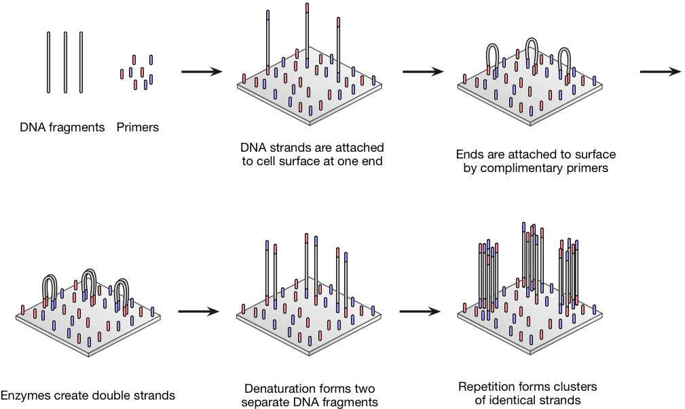
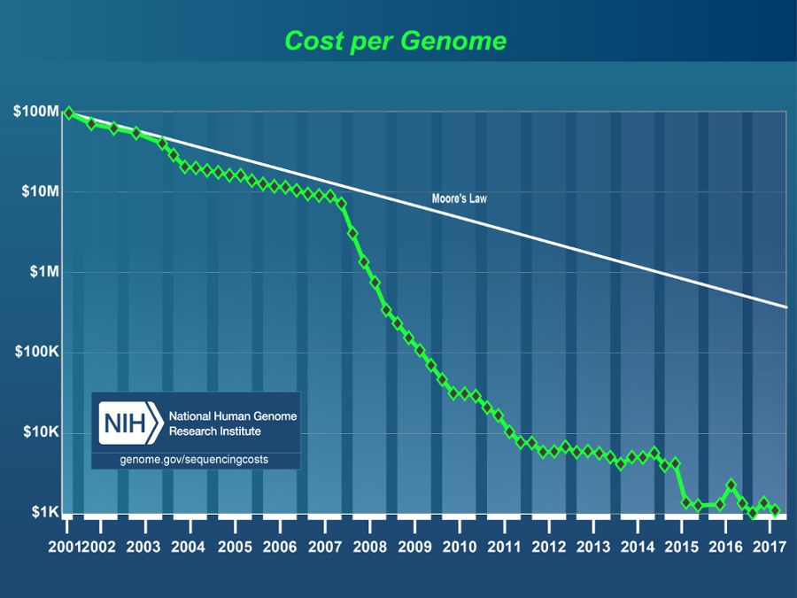
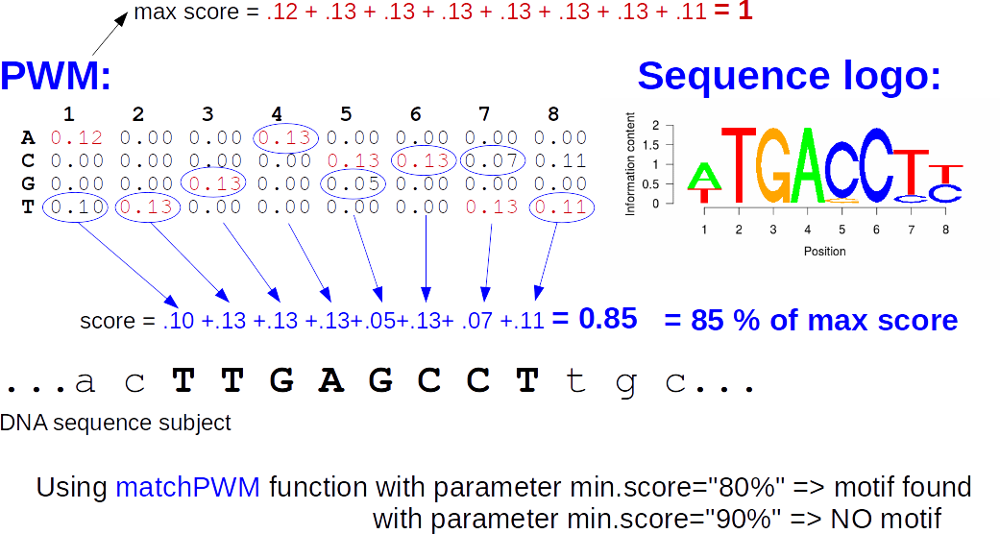
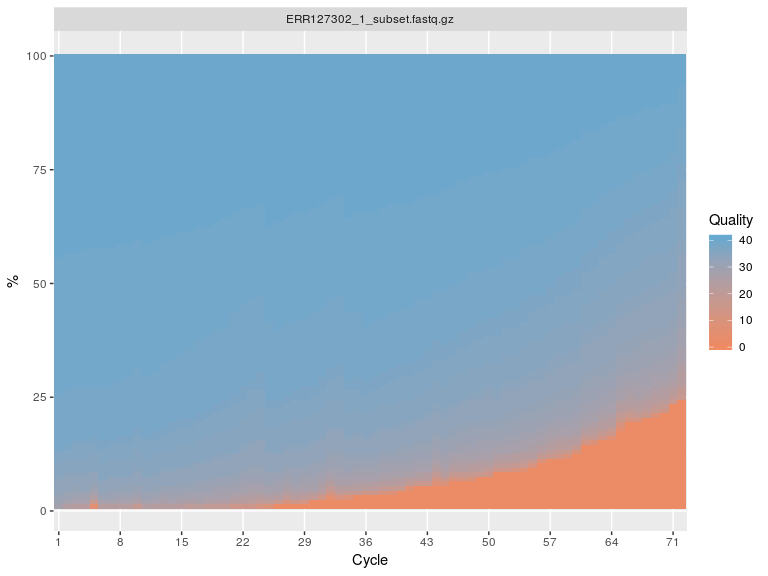
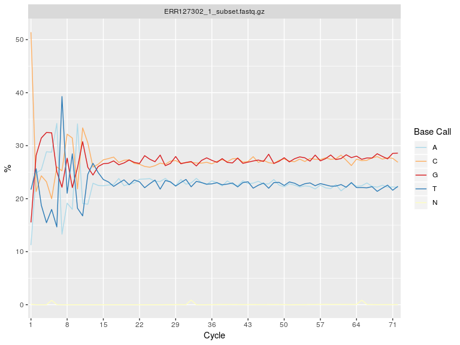
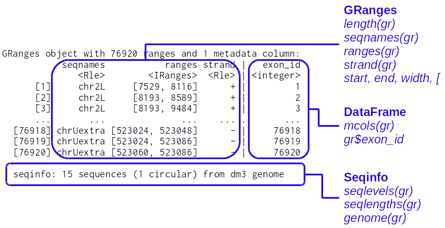
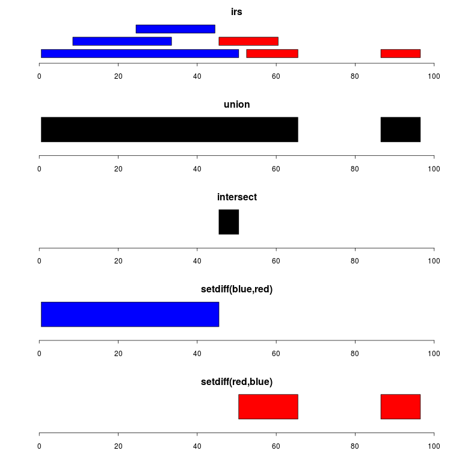
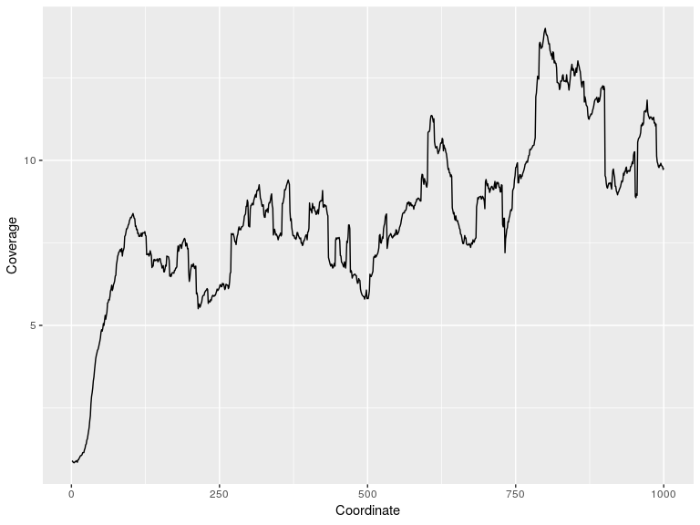

# Outline

 1. What is NGS? Why BioC for NGS?
 2. Working with sequences
 3. Working with aligned reads
 4. Working with ranges
 5. Annotations
 6. Import / Export 
 7. Visualization


# Outline
 1. What is NGS? Why BioC for NGS?
 2. <span style="color:grey">Working with sequences</span>
 3. <span style="color:grey">Working with aligned reads</span>
 4. <span style="color:grey">Working with ranges</span>
 5. <span style="color:grey">Annotations</span>
 6. <span style="color:grey">Import / Export</span>
 7. <span style="color:grey">Visualization</span>


# NGS development


# NGS basics


# How does NGS work?
Illumina sequencing: bridge PCR (illustrations from [atdbio](https://www.atdbio.com/content/58/Next-generation-sequencing))



# Illumina sequencing
Illustrations from [NMBU](http://wiki.nmbu.org/index.php/Illumina_(Solexa)_sequencing)


# Other technologies?


# Increased throughput
... and decreased prices



# Bioconductor


# Bioconductor and the NGS workflow


# Bioconductor and the NGS workflow


# Specialized packages for about anything...
* RNA-seq / Differential expression analysis:  
    + <span style="color:chocolate">limma, DESeq2, edgeR, DEXseq, spliceR, rnaSeqMap, ...</span>
* ChIP-seq / peak finding / annotation:
    + <span style="color:chocolate">ChIPQC, chipseq, NarrowPeaks, DiffBind, MMDiff, epigenomix, jmosaics, csaw, ChIPseeker...</span>
* DNA methylation / DMR:
    + <span style="color:chocolate">bsseq, BiSeq, methylumi, minfi, Rnbeads, ...</span>
* 3C/4C/Hi-C/ChIA-PET / genomic interactions:
    + <span style="color:chocolate">r3Cseq, FourCSeq HiTC , GOTHiC, GenomicInterations, InteractionSet, ...</span>
* CAGE-seq: <span style="color:chocolate;font-size:80%"><i>TSSi, CAGEr, ...</i></span>
* DNAse-seq: <span style="color:chocolate;font-size:80%"><i>DNaseR, ...</i></span>
* MNase-seq: <span style="color:chocolate;font-size:80%"><i>PING, ...</i></span>
* ...   


# Outline
 1. <span style="color:grey">What is NGS? Why BioC for NGS?</span>
 2. Working with sequences
 3. <span style="color:grey">Working with aligned reads</span>
 4. <span style="color:grey">Working with ranges</span>
 5. <span style="color:grey">Annotations</span>
 6. <span style="color:grey">Import / Export</span>
 7. <span style="color:grey">Visualization</span>

# The fasta format


* Extension: .fa; .fasta  
<https://en.wikipedia.org/wiki/FASTA_format>


# Biostrings containers and accessors

```r
library(Biostrings)
```

**Containers:**  

- XString – BString, DNAString, RNAString, AAString  
- XStringSet – multiple sequences  
- XStringViews  
  
*"Masked" sequences are also supported (see ?masks)*  
  

**Manipulation:**  

- [[ and [ for subsetting  
- subseq
- toString  
- Views  
...

# Importing sequences from a fasta file

```r
dm3_upstream_filepath <- system.file("extdata","dm3_upstream2000.fa.gz",
                                    package="Biostrings")
dm3_upstream <- readDNAStringSet(dm3_upstream_filepath)
dm3_upstream
```

```
##   A DNAStringSet instance of length 26454
##         width seq                                      names               
##     [1]  2000 GTTGGTGGCCCACCAGTGC...GTTTACCGGTTGCACGGT NM_078863_up_2000...
##     [2]  2000 TTATTTATGTAGGCGCCCG...CGGAAAGTCATCCTCGAT NM_001201794_up_2...
##     [3]  2000 TTATTTATGTAGGCGCCCG...CGGAAAGTCATCCTCGAT NM_001201795_up_2...
##     [4]  2000 TTATTTATGTAGGCGCCCG...CGGAAAGTCATCCTCGAT NM_001201796_up_2...
##     [5]  2000 TTATTTATGTAGGCGCCCG...CGGAAAGTCATCCTCGAT NM_001201797_up_2...
##     ...   ... ...
## [26450]  2000 ATTTACAAGACTAATAAAG...ATTAAATTTCAATAAAAC NM_001111010_up_2...
## [26451]  2000 GATATACGAAGGACGACCT...TTTGAGTTGTTATATATT NM_001015258_up_2...
## [26452]  2000 GATATACGAAGGACGACCT...TTTGAGTTGTTATATATT NM_001110997_up_2...
## [26453]  2000 GATATACGAAGGACGACCT...TTTGAGTTGTTATATATT NM_001276245_up_2...
## [26454]  2000 CGTATGTATTAGTTAACTC...AAGTGTAAGAACAAATTG NM_001015497_up_2...
```

```r
dm3_upstream[[5]]
```

```
##   2000-letter "DNAString" instance
## seq: TTATTTATGTAGGCGCCCGTTCCCGCAGCCAAAG...ATTAATCGATAGATACGGAAAGTCATCCTCGAT
```


# Practice with your own DNA sequence  
  
Like `LETTERS` in base R, the [Biostrings](http://bioconductor.org/packages/release/bioc/html/Biostrings.html) package provides a `DNA_ALPHABET`.  
  
  
- Use it to create a  `DNAString`  object containing a random sequence of length 50.
- Get the reverse complement of this sequence
- Calculate the frequency of each A, T, G and C in your sequence.
- Calculate the GC% of your sequence
- Extract the nucleotides between 11 and 20.
- Convert the sequence to a character string
- Extract the first 5 bases every 10 bases

_Note that masks can also be associated to Biostrings and BSgenome objects_


# Working with large fasta files
The [Rsamtools](http://bioconductor.org/packages/release/bioc/html/Rsamtools.html) package provides function to work with large fasta file(s).  
The <span style="color:blue">FaFile</span> function creates a reference to an indexed fasta file (see `?FaFile`).  

This is particularly useful to extract sequences within a fasta file:


```r
library(Rsamtools)
fl <- system.file("extdata", "ce2dict1.fa", package="Rsamtools",
                  mustWork=TRUE)
fa <- open(FaFile(fl))
seqinfo(fa)
```

```
## Seqinfo object with 5 sequences from an unspecified genome:
##   seqnames  seqlengths isCircular genome
##   pattern01         18         NA   <NA>
##   pattern02         25         NA   <NA>
##   pattern03         24         NA   <NA>
##   pattern04         24         NA   <NA>
##   pattern05         25         NA   <NA>
```

```r
getSeq(fa, GRanges("pattern05:11-20"))
```

```
##   A DNAStringSet instance of length 1
##     width seq                                          names               
## [1]    10 TTTGGTGGTA                                   pattern05
```


# Whole genome sequences in BSgenome packages

```r
library(BSgenome.Dmelanogaster.UCSC.dm3)
```


```r
names(Dmelanogaster)[1:5]
```

```
## [1] "chr2L" "chr2R" "chr3L" "chr3R" "chr4"
```

```r
Dmelanogaster$chr2L
```

```
##   23011544-letter "DNAString" instance
## seq: CGACAATGCACGACAGAGGAAGCAGAACAGATAT...TATTTGCAAATTTTGATGAACCCCCCTTTCAAA
```


For a masked version of the genome, see:

```r
library(BSgenome.Dmelanogaster.UCSC.dm3.masked)
```


For adding SNPs info see:

```r
library(BSgenome)
?available.SNPs
```


# Pattern matching


```r
matchPattern("KATCGATA", dm3_upstream[[592]], fixed=FALSE)
```

```
##   Views on a 2000-letter DNAString subject
## subject: TCCCAAATTAACTAATGGCTTTTCACGCAGAT...GCCTCACTTTTGTCCACATCTTTTGAAAGGC
## views:
##     start end width
## [1]    72  79     8 [GATCGATA]
## [2]   512 519     8 [TATCGATA]
## [3]   518 525     8 [TATCGATA]
```
*K is G or T, see [IUPAC code](http://www.bioinformatics.org/sms/iupac.html)* 
  
Other functions to search for patterns: <span style="color:blue">matchProbePair, findPalindromes, ...</span>


```r
vmatchPattern('TATCGATA', Dmelanogaster)
```

# Position weight matrix (PWM)
Probabilistic description of short sequences largely used for TF binding sites  

Get a motif (as a PFM):

```r
EcRMotif <- MotifDb::query(MotifDb,"EcR")[1]
```

<div class="col2-left">
seqLogo representation:  

  
</div>

<div class="col2-right">
  Convert to PWM:

```r
EcRpfm <- apply(reverseComplement(EcRMotif[[1]]) *
                    as.integer(mcols(EcRMotif)$sequenceCount),
                2, as.integer)
rownames(EcRpfm) <- rownames(EcRMotif[[1]])
EcRpwm <- PWM(EcRpfm)
```

<table class="table table-striped table-condensed" style="font-size: 14px; width: auto !important; margin-left: auto; margin-right: auto;">
<caption style="font-size: initial !important;">PWM for EcR motif</caption>
 <thead>
  <tr>
   <th style="text-align:left;">   </th>
   <th style="text-align:right;"> 1 </th>
   <th style="text-align:right;"> 2 </th>
   <th style="text-align:right;"> 3 </th>
   <th style="text-align:right;"> 4 </th>
   <th style="text-align:right;"> 5 </th>
   <th style="text-align:right;"> 6 </th>
   <th style="text-align:right;"> 7 </th>
   <th style="text-align:right;"> 8 </th>
  </tr>
 </thead>
<tbody>
  <tr>
   <td style="text-align:left;"> A </td>
   <td style="text-align:right;"> 0.11 </td>
   <td style="text-align:right;"> 0.13 </td>
   <td style="text-align:right;"> 0.00 </td>
   <td style="text-align:right;"> 0.00 </td>
   <td style="text-align:right;"> 0.00 </td>
   <td style="text-align:right;"> 0.00 </td>
   <td style="text-align:right;"> 0.13 </td>
   <td style="text-align:right;"> 0.10 </td>
  </tr>
  <tr>
   <td style="text-align:left;"> C </td>
   <td style="text-align:right;"> 0.00 </td>
   <td style="text-align:right;"> 0.00 </td>
   <td style="text-align:right;"> 0.00 </td>
   <td style="text-align:right;"> 0.05 </td>
   <td style="text-align:right;"> 0.00 </td>
   <td style="text-align:right;"> 0.13 </td>
   <td style="text-align:right;"> 0.00 </td>
   <td style="text-align:right;"> 0.00 </td>
  </tr>
  <tr>
   <td style="text-align:left;"> G </td>
   <td style="text-align:right;"> 0.11 </td>
   <td style="text-align:right;"> 0.07 </td>
   <td style="text-align:right;"> 0.13 </td>
   <td style="text-align:right;"> 0.13 </td>
   <td style="text-align:right;"> 0.00 </td>
   <td style="text-align:right;"> 0.00 </td>
   <td style="text-align:right;"> 0.00 </td>
   <td style="text-align:right;"> 0.00 </td>
  </tr>
  <tr>
   <td style="text-align:left;"> T </td>
   <td style="text-align:right;"> 0.00 </td>
   <td style="text-align:right;"> 0.00 </td>
   <td style="text-align:right;"> 0.00 </td>
   <td style="text-align:right;"> 0.00 </td>
   <td style="text-align:right;"> 0.13 </td>
   <td style="text-align:right;"> 0.00 </td>
   <td style="text-align:right;"> 0.00 </td>
   <td style="text-align:right;"> 0.12 </td>
  </tr>
</tbody>
</table>
</div>


# Scanning a sequence with a PWM




# Scanning a sequence with a PWM

Search the motif in chr4 ('+' strand only):

```r
EcRHits <- matchPWM(EcRpwm, Dmelanogaster$chr4)
length(EcRHits)
```

```
## [1] 2029
```

```r
EcRHits[1:2]
```

```
##   Views on a 1351857-letter DNAString subject
## subject: GAATTCGCGTCCGCTTACCCATGTGCCTGTGG...TAAAAGCAGCCGTCGATTTGAGATATATGAA
## views:
##     start end width
## [1]   255 262     8 [AGGGTGAT]
## [2]   308 315     8 [AAGGGCAT]
```
For minus strand: use the <span style="color:blue">reverseComplement</span> of PWM

# Motif pipeline example
A typical pipeline:  
  
- Find a set of ChIP-seq peaks for a TF as a bed file (eg. [ENCODE](https://www.encodeproject.org/) or [modENCODE](http://www.modencode.org/).  
  
- Use a de novo motif search to identify enriched motifs (e.g. [RSAT](http://pedagogix-tagc.univ-mrs.fr/rsat/RSAT_portal.html), [MEME](http://meme-suite.org/), [BaMM motif](https://bammmotif.mpibpc.mpg.de/), R packages [rGADEM](http://bioconductor.org/packages/release/bioc/html/rGADEM.html) or [BCRANK](http://bioconductor.org/packages/release/bioc/html/BCRANK.html))  
  
- Get a PFM or PWM from the results. Convert as PWM if necessary.
  
- Scan the genome with the PWM (background frequencies!) 
  
- Annotate the identified motif location (TSS? enhancers? near specific groups of genes? etc.)  
  
- ...  

# More sequence tools:

**Other packages to work with motifs:**  
- [MotifDb](http://bioconductor.org/packages/release/bioc/html/MotifDb.html)  
- [seqLogo](http://bioconductor.org/packages/release/bioc/html/seqLogo.html)  
- [TFBSTools](http://bioconductor.org/packages/release/bioc/html/TFBSTools.html)  
- [rGADEM](http://bioconductor.org/packages/release/bioc/html/rGADEM.html)  
- [PWMEnrich](http://bioconductor.org/packages/release/bioc/html/PWMEnrich.html)  
- [BCRANK](http://bioconductor.org/packages/release/bioc/html/BCRANK.html)  
- [MotIV](http://bioconductor.org/packages/release/bioc/html/MotIV.html)  
- ...  

**For database queries (+ other tools for AA sequences):**  
[seqinr](https://cran.r-project.org/package=seqinr)  

# Sequence alignment

<span style="color:blue">pairwiseAlignment</span> is the core function:

```r
pairwiseAlignment('CTTGCAGTGGTGTATTCATAC',
                  dm3_upstream[[1]],
                  type='global-local')
```

```
## Global-Local PairwiseAlignmentsSingleSubject (1 of 1)
## pattern:   [1] CTTGCAGTGG-TGTATTCATAC 
## subject: [713] CTTGCAGTGGGTGTAT--ATAC 
## score: 5.653368
```

Levensthein edit distance:

```r
stringDist(c("lazy", "HaZy", "crAzY"))
```

```
##   1 2
## 2 2  
## 3 4 5
```

```r
stringDist(c("lazy", "HaZy", "crAzY"), ignoreCase = TRUE)
```

```
##   1 2
## 2 1  
## 3 2 2
```


# Exercise: compare indexes
Consider a sequencing run with 10 multiplexed samples. We have the following 16 indexes available.  


```r
indx <- DNAStringSet( c("ATCACG", "CGATGT", "TTAGGC", "TGACCA",
                        "ACAGTG", "GCCAAT", "CAGATC", "ACTTGA",
                        "GATCAG", "TAGCTT", "GGCTAC", "CTTGTA",
                        "CGGCTA", "TCCGCG", "ATGTCA", "AGCGAT"))
```

- Use the `stringDist` function to compare these indexes and choose the 10 "best" indexes 
- Evaluate if all 4 bases are sequenced at each sequencing cycles (use the `consensusMatrix` function)


# Fastq format
* Extension: .fq; .fastq <https://en.wikipedia.org/wiki/FASTQ_format>

  

$Q = -10*{\log_{10}(P)}$ <=> $P = 10^{-\frac{Q}{10}}$


# Working with fastq files
The [ShortRead](http://bioconductor.org/packages/release/bioc/html/ShortRead.html) package <span class="citeref">[@pmid19654119]</span>


Import a fastq file with 20K reads:

```r
fq1_path <- system.file(package="ShortRead","extdata","E-MTAB-1147",
                        "ERR127302_1_subset.fastq.gz")
myFastq <- readFastq(fq1_path)
```

Explore with:

```r
myFastq
```

```
## class: ShortReadQ
## length: 20000 reads; width: 72 cycles
```

```r
myFastq[1:3]
```

```
## class: ShortReadQ
## length: 3 reads; width: 72 cycles
```


# Working with fastq files

```r
head(sread(myFastq), 2)
```

```
##   A DNAStringSet instance of length 2
##     width seq
## [1]    72 GTCTGCTGTATCTGTGTCGGCTGTCTCGCGG...CAATGAAGGCCTGGAATGTCACTACCCCCAG
## [2]    72 CTAGGGCAATCTTTGCAGCAATGAATGCCAA...GTGGCTTTTGAGGCCAGAGCAGACCTTCGGG
```

```r
head(quality(myFastq), 2)
```

```
## class: FastqQuality
## quality:
##   A BStringSet instance of length 2
##     width seq
## [1]    72 HHHHHHHHHHHHHHHHHHHHEBDBB?B:BBG...FEFBDBD@DDECEE3>:?;@@@>?=BAB?##
## [2]    72 IIIIHIIIGIIIIIIIHIIIIEGBGHIIIIH...IHIIIHIIIIIGIIIEGIIGBGE@DDGGGIG
```

```r
head(id(myFastq), 2)
```

```
##   A BStringSet instance of length 2
##     width seq
## [1]    53 ERR127302.8493430 HWI-EAS350_0441:1:34:16191:2123#0/1
## [2]    53 ERR127302.21406531 HWI-EAS350_0441:1:88:9330:2587#0/1
```

```r
encoding(quality(myFastq))[seq(1,51,by=2)]
```

```
##  !  #  %  '  )  +  -  /  1  3  5  7  9  ;  =  ?  A  C  E  G  I  K  M  O  Q 
##  0  2  4  6  8 10 12 14 16 18 20 22 24 26 28 30 32 34 36 38 40 42 44 46 48 
##  S 
## 50
```

```r
alphabet(sread(myFastq))[1:4]
```

```
## [1] "A" "C" "G" "T"
```


# Large fastq files
Functions <span style="color:blue">FastqSampler</span> and <span style="color:blue">FastqStreamer</span>  
Count the reads in a fastq file:

```r
nr_myFastq <- 0
strm <- FastqStreamer(fq1_path,1000)
repeat {
 ## Get FASTQ chunk:
  fq <- yield(strm)
  if (length(fq) == 0)
   break
 ## Do something on the chunk:
  nr_myFastq <- nr_myFastq + length(fq)
}
close(strm) #close the connection
nr_myFastq
```

```
## [1] 20000
```


# QC on fastq files
[fastqc](http://www.bioinformatics.babraham.ac.uk/projects/fastqc/) from Babraham  

Several tools available in R/BioC: [ShortRead](http://bioconductor.org/packages/release/bioc/html/ShortRead.html) <span style="color:blue">qa</span>/<span style="color:blue">qa2</span> functions, [qrqc](http://bioconductor.org/packages/release/bioc/html/qrqc.html), [seqTools](http://bioconductor.org/packages/release/bioc/html/seqTools.html), [Rqc](http://bioconductor.org/packages/release/bioc/html/Rqc.html)  

Run `library(Rqc)` on a fastq file:

```r
rqcResultSet <- rqcQA(fq1_path, sample=TRUE)
```
  
<div class="col2-left">  
  

```r
rqcCycleQualityPlot(rqcResultSet)
```


  
</div>
  
<div class="col2-right">  
  

```r
rqcCycleBaseCallsLinePlot(rqcResultSet)
```


  
</div>


# Filtering a fastq file

Define some filters:

```r
max1N <- nFilter(threshold=1L) #No 'Ns' in the reads
goodq <- srFilter(function(x){apply(as(quality(x),"matrix"),
                            1,median,na.rm=T)>=30},
                 name="MedianQualityAbove30")
myFilter <- compose(max1N,goodq) #combine filters
```

# Filtering a fastq file

Create a function to filter and trim the reads:

```r
FilterAndTrim <- function(fl,destination=sprintf("%s_filtered",fl))
{
  stream <- FastqStreamer(fl) ## open input stream
  on.exit(close(stream))
  repeat {
    ###get fastq chunk  
    fq <- yield(stream)
    if (length(fq)==0)
      break
    ###TRIM first 4 and last 2 bases
    fq <- narrow(fq,start=5,end=70)
    ###FILTER
    fq <- fq[myFilter(fq)]
    ###write filtered fastq
    writeFastq(fq, destination, mode="a")
  }
}
```

Apply the function:

```r
FilterAndTrim(fqFiles[1],
              destination=file.path(getwd(),"FilteredFastq.fq"))
```


# Outline
 1. <span style="color:grey">What is NGS? Why BioC for NGS?</span>
 2. <span style="color:grey">Working with sequences</span>
 3. Working with aligned reads
 4. <span style="color:grey">Working with ranges</span>
 5. <span style="color:grey">Annotations</span>
 6. <span style="color:grey">Import / Export</span>
 7. <span style="color:grey">Visualization</span>


# Alignment of NGS reads
R packages: [Rbowtie](http://bioconductor.org/packages/release/bioc/html/Rbowtie.html), [Rbowtie2](http://bioconductor.org/packages/release/bioc/html/Rbowtie2.html), [QuasR](http://bioconductor.org/packages/release/bioc/html/QuasR.html) <span class="citeref">[@pmid25417205]</span>, [Rsubread](http://bioconductor.org/packages/release/bioc/html/Rsubread.html) <span class="citeref">[@pmid23558742; @pmid24227677]</span>  
  
__[Mapping quality](http://genome.sph.umich.edu/wiki/Mapping_Quality_Scores) scores__ <span class="citeref">[MAQ aligner in @pmid18714091]</span>:  
- base qualities (Phred scores)  
- mismatches/indels  
- repetitions  
- paired reads  

* __Aligning unspliced reads:__  
     + [Bowtie](http://bowtie-bio.sourceforge.net/index.shtml) <span class="citeref">[@pmid19261174]</span> / [Bowtie2](http://bowtie-bio.sourceforge.net/bowtie2/index.shtml) <span class="citeref">[@pmid22388286]</span>; [BWA](http://bio-bwa.sourceforge.net/) <span class="citeref">[@pmid19451168; @pmid20080505]</span>; [GEM mapper](http://algorithms.cnag.cat/wiki/The_GEM_library) <span class="citeref">[@pmid23103880]</span>  
  
* __Aligning spliced reads__  
     + [TopHat2](http://ccb.jhu.edu/software/tophat/index.shtml) <span class="citeref">[@pmid19289445; @pmid23618408]</span> / [HISAT2](http://ccb.jhu.edu/software/hisat2/index.shtml) <span class="citeref">[@pmid25751142]</span>; [MapSplice](http://www.netlab.uky.edu/p/bioinfo/MapSplice) <span class="citeref">[@pmid20802226]</span>; [STAR](https://github.com/alexdobin/STAR) <span class="citeref">[@pmid23104886]</span>  


See also [Wikipedia's list of alignment tools](https://en.wikipedia.org/wiki/List_of_sequence_alignment_software)  


# SAM/BAM format


[SAM format specifications](https://github.com/samtools/hts-specs)  
Useful tools: [samtools](http://www.htslib.org/), [Picard tools](http://broadinstitute.github.io/picard/)


# BAM file import


```r
library(Rsamtools);library(GenomicAlignments)
library(pasillaBamSubset)
sr <- untreated1_chr4() #single-end
pr <- untreated3_chr4() #paired-end
```

Use samtools to index the file

```r
indexBam(sr_bamFile)
```

All functions from [samtools](http://www.htslib.org/) are available with R (e.g. <span style="color:blue">sortBam</span>, <span style="color:blue">countBam</span>, <span style="color:blue">filterBam</span>, <span style="color:blue">mergeBam</span>, etc.)


# BAM file import

Define what to import

```r
which=GRanges(seqnames="chr4",
              ranges=IRanges(c(75000,1190000),
                             c(85000,1203000)),
              strand="*")
what = c("rname","strand","pos","qwidth","seq")
flag=scanBamFlag(isDuplicate=FALSE)
param=ScanBamParam(which=which,what=what,flag=flag)
```


# Import single-end reads

```r
srbam <- readGAlignments(sr,param=param)
srbam[1:2]
```

```
## GAlignments object with 2 alignments and 5 metadata columns:
##       seqnames strand             cigar    qwidth     start       end
##          <Rle>  <Rle>       <character> <integer> <integer> <integer>
##   [1]     chr4      + 21M13615N50M55N4M        75     72990     86734
##   [2]     chr4      - 4M13615N50M55N21M        75     73007     86751
##           width     njunc |    rname   strand       pos    qwidth
##       <integer> <integer> | <factor> <factor> <integer> <integer>
##   [1]     13745         2 |     chr4        +     72990        75
##   [2]     13745         2 |     chr4        -     73007        75
##                           seq
##                <DNAStringSet>
##   [1] AAAAACTGCA...CGTAGCCACA
##   [2] ATACCTGTGA...TGGACGGCTG
##   -------
##   seqinfo: 8 sequences from an unspecified genome
```

# Import paired-end reads

```r
prbam <- readGAlignmentPairs(pr)
prbam[1:2]
```

```
## GAlignmentPairs object with 2 pairs, strandMode=1, and 0 metadata columns:
##       seqnames strand :     ranges --       ranges
##          <Rle>  <Rle> :  <IRanges> --    <IRanges>
##   [1]     chr4      + : [169, 205] -- [ 326,  362]
##   [2]     chr4      + : [943, 979] -- [1086, 1122]
##   -------
##   seqinfo: 8 sequences from an unspecified genome
```

There is also a <span style="color:blue">BamFile</span> function to create a reference to a large BAM file without importing it (as for <span style="color:blue">FaFile</span>).  
See also the [GenomicFiles](http://bioconductor.org/packages/release/bioc/html/GenomicFiles.html) package for working on many, large files

# Outline
 1. <span style="color:grey">What is NGS? Why BioC for NGS?</span>
 2. <span style="color:grey">Working with sequences</span>
 3. <span style="color:grey">Working with aligned reads</span>
 4. Working with ranges
 5. <span style="color:grey">Annotations</span>
 6. <span style="color:grey">Import / Export</span>
 7. <span style="color:grey">Visualization</span>


# Working with genomic ranges

Packages [IRanges](http://bioconductor.org/packages/release/bioc/html/IRanges.html) & [GenomicRanges](http://bioconductor.org/packages/release/bioc/html/GenomicRanges.html) <span class="citeref">[@pmid23950696]</span>  
See also the [Introduction by Martin Morgan, 2014](http://master.bioconductor.org/help/course-materials/2014/SeattleFeb2014/Ranges_slides.pdf)  

- __Importance of range concept__
    + Genomic data and annotations can be represented by ranges
    + Many biological questions correspond to queries on ranges:
        - How many reads overlap each gene / exon / splice junction?
        - Where does my protein bind in ChiP-seq experiment?
        - How many of my peaks overlap with promoters?
      
      
- __Where do range-like objects come from?__
    + DATA (e.g. BAM, BED, WIG files,...)
    + ANNOTATIONS (BED, GFF/GTF, TxDb*, AnnotationHub,...)


# IRanges Definition
- __What is an IRange?__
    + 2 vectors out of 'start', 'end' and 'width' (SEW ; $end = start + width - 1$)
    + closed intervals (i.e. include end points)
    + zero-width convention: $width \geq 0$ ; $end=start-1 \Leftrightarrow width=0$
    + can be named

A simple IRanges:

```r
eg = IRanges(start = c(1, 10, 20),
              end = c(4, 10, 19),
              names = c("A", "B", "C"))
eg
```

```
## IRanges object with 3 ranges and 0 metadata columns:
##         start       end     width
##     <integer> <integer> <integer>
##   A         1         4         4
##   B        10        10         1
##   C        20        19         0
```


# IRanges 

A bigger IRanges:  

```r
set.seed(123) #For reproducibility
start = floor(runif(10000, 1, 1000))
width = floor(runif(10000, 0, 100))
ir = IRanges(start, width=width)
ir
```

```
## IRanges object with 10000 ranges and 0 metadata columns:
##               start       end     width
##           <integer> <integer> <integer>
##       [1]       288       318        31
##       [2]       788       819        32
##       [3]       409       495        87
##       [4]       883       914        32
##       [5]       940       951        12
##       ...       ...       ...       ...
##    [9996]       466       492        27
##    [9997]       899       983        85
##    [9998]       114       124        11
##    [9999]       571       595        25
##   [10000]       900       965        66
```


# IRanges 

Vector-like behavior: _length, [_  
Accessors: _start, end, width, names_  


```r
length(ir)
```

```
## [1] 10000
```

```r
width(ir[1:4])
```

```
## [1] 31 32 87 32
```

```r
names(eg)
```

```
## [1] "A" "B" "C"
```


# IRanges 

Some useful functions:

```r
mid(ir[1:4])
```

```
## [1] 303 803 452 898
```

```r
successiveIRanges(width=rep(10,3),gap=10)
```

```
## IRanges object with 3 ranges and 0 metadata columns:
##           start       end     width
##       <integer> <integer> <integer>
##   [1]         1        10        10
##   [2]        21        30        10
##   [3]        41        50        10
```

```r
tile(ir[1:2],n=2)
```

```
## IRangesList of length 2
## [[1]]
## IRanges object with 2 ranges and 0 metadata columns:
##           start       end     width
##       <integer> <integer> <integer>
##   [1]       288       302        15
##   [2]       303       318        16
## 
## [[2]]
## IRanges object with 2 ranges and 0 metadata columns:
##           start       end     width
##       <integer> <integer> <integer>
##   [1]       788       803        16
##   [2]       804       819        16
```


# IRangesList - List objects


```r
irl  <- split(ir,width(ir)) # an IRangesList
irl[[1]][1:3]
```

```
## IRanges object with 3 ranges and 0 metadata columns:
##           start       end     width
##       <integer> <integer> <integer>
##   [1]       321       320         0
##   [2]       600       599         0
##   [3]       184       183         0
```

```r
length(irl)
```

```
## [1] 100
```

```r
head(elementNROWS(irl))
```

```
##   0   1   2   3   4   5 
##  96  83 108  95  84 110
```

# S4Vectors List objects
List = list with all elements of the same type. See `?List`

```r
start(irl)[1:2]
```

```
## IntegerList of length 2
## [["0"]] 321 600 184 297 276 816 87 729 ... 858 52 85 188 308 289 936 669
## [["1"]] 915 576 706 235 678 647 451 138 ... 638 66 979 740 300 869 433 645
```

```r
log(start(irl)[1:2])
```

```
## NumericList of length 2
## [["0"]] 5.77144112313002 6.39692965521615 ... 6.50578406012823
## [["1"]] 6.81892406527552 6.35610766069589 ... 6.46925031679577
```

# Genomic ranges
- __GRanges builds on IRanges__
    + 'seqnames' (typically chromosomes) and 'strand' ('+', '-' or '*')
    + (optional) 'seqinfo' for genome information
    + (optional) 'mcols' for 'metadata' data frame on each range

- __Genome coordinates__
    + [1-based](https://www.biostars.org/p/84686/)
    + 'left-most' ('start' of ranges on the 'minus' strand are the left-most coordinate, rather than the 5' coordinate)  

Package [GenomicRanges](http://bioconductor.org/packages/release/bioc/html/GenomicRanges.html):

```r
library(GenomicRanges)
```


# GRanges  
A typical use case:


```r
library(TxDb.Dmelanogaster.UCSC.dm3.ensGene)
txdb <- TxDb.Dmelanogaster.UCSC.dm3.ensGene
(gr <- exons(txdb))
```

```
## GRanges object with 76920 ranges and 1 metadata column:
##            seqnames           ranges strand |   exon_id
##               <Rle>        <IRanges>  <Rle> | <integer>
##       [1]     chr2L     [7529, 8116]      + |         1
##       [2]     chr2L     [8193, 8589]      + |         2
##       [3]     chr2L     [8193, 9484]      + |         3
##       ...       ...              ...    ... .       ...
##   [76918] chrUextra [523024, 523048]      - |     76918
##   [76919] chrUextra [523024, 523086]      - |     76919
##   [76920] chrUextra [523060, 523086]      - |     76920
##   -------
##   seqinfo: 15 sequences (1 circular) from dm3 genome
```


# GRanges


<br/>

Operations on GRanges are generally _seqnames-aware_ and _strand-aware_ (see argument `ignore.strand`)


# GRangesList

```r
(grl <- exonsBy(txdb,by="gene"))
```

```
## GRangesList object of length 15682:
## $FBgn0000003 
## GRanges object with 1 range and 2 metadata columns:
##       seqnames             ranges strand |   exon_id   exon_name
##          <Rle>          <IRanges>  <Rle> | <integer> <character>
##   [1]    chr3R [2648220, 2648518]      + |     45123        <NA>
## 
## $FBgn0000008 
## GRanges object with 13 ranges and 2 metadata columns:
##        seqnames               ranges strand | exon_id exon_name
##    [1]    chr2R [18024494, 18024531]      + |   20314      <NA>
##    [2]    chr2R [18024496, 18024713]      + |   20315      <NA>
##    [3]    chr2R [18024938, 18025756]      + |   20316      <NA>
##    ...      ...                  ...    ... .     ...       ...
##   [11]    chr2R [18059821, 18059938]      + |   20328      <NA>
##   [12]    chr2R [18060002, 18060339]      + |   20329      <NA>
##   [13]    chr2R [18060002, 18060346]      + |   20330      <NA>
## 
## ...
## <15680 more elements>
## -------
## seqinfo: 15 sequences (1 circular) from dm3 genome
```

# Intra-ranges operations

See `?'intra-range-methods'`


<br/>
Also <span style="color:blue">reflect</span>, <span style="color:blue">narrow</span> and <span style="color:blue">threebands</span>, <span style="color:blue">restrict</span> and <span style="color:blue">trim</span>


# Inter-ranges operations

See `?'inter-range-methods'`


# Set operations - Nearest methods

See `?'setops-methods'`



<br/>
See also `?'nearest-methods'` including <span style="color:blue">nearest</span>, <span style="color:blue">precede</span>, <span style="color:blue">follow</span> and <span style="color:blue">distance</span>,


# Between-range operations / Overlaps

_Q: Number of TSS located at >500bp from another gene?_  

Get all genes and transcrits:

```r
Dmg <- genes(txdb) 
Dmt <- transcriptsBy(txdb,by="gene")
```
Get all TSS:

```r
Dm_tss <- unlist(reduce(promoters(Dmt,up=0,down=1),min.gap=0L))
```

Proportion of TSS overlapping with more than 1 gene +/- 500bp:

```r
mean(countOverlaps(Dm_tss,Dmg+500) > 1) #!strand-aware
```

```
## [1] 0.2509943
```

```r
mean(countOverlaps(Dm_tss,Dmg+500,ignore.strand=T) > 1)
```

```
## [1] 0.5167952
```


# Overlaps  

Obtaining the overlaps:  

```r
fov <- findOverlaps(Dm_tss,Dmg+500,ignore.strand=T) ; fov[1:3]
```

```
## Hits object with 3 hits and 0 metadata columns:
##       queryHits subjectHits
##       <integer>   <integer>
##   [1]         1           1
##   [2]         1        1383
##   [3]         2           2
##   -------
##   queryLength: 20869 / subjectLength: 15682
```
Two genes on opposite strands that are overlapping:

```r
Dmg[subjectHits(fov)[queryHits(fov)==1]]
```

```
## GRanges object with 2 ranges and 1 metadata column:
##               seqnames             ranges strand |     gene_id
##                  <Rle>          <IRanges>  <Rle> | <character>
##   FBgn0000003    chr3R [2648220, 2648518]      + | FBgn0000003
##   FBgn0011904    chr3R [2648685, 2648757]      - | FBgn0011904
##   -------
##   seqinfo: 15 sequences (1 circular) from dm3 genome
```

_Q: How many reads in srbam overlap with gene FBgn0002521?_  

```r
length(subsetByOverlaps(srbam,Dmg["FBgn0002521"]))
```

```
## [1] 358
```

_Q: How many reads in srbam overlap with exons of FBgn0002521?_  

```r
length(srbam[overlapsAny(srbam,grl[["FBgn0002521"]])])
```

```
## [1] 346
```


# Counting reads mapping on features  

Reads mapping on exons:

```r
ctex <- summarizeOverlaps(features = grl[seqnames(Dmg)=="chr4"],
                             reads = srbam,
                              mode = Union)
```


```r
head(assays(ctex)$counts)
```

```
##             reads
## FBgn0002521   346
## FBgn0004607     0
## FBgn0004859     4
## FBgn0005558     0
## FBgn0005561     0
## FBgn0005666     0
```


# SummarizedExperiment
<span class="citeref">[@pmid25633503]</span>


# Rle


```r
srbam <- readGAlignments(sr)
(covr <- coverage(srbam))
```

```
## RleList of length 8
## $chr2L
## integer-Rle of length 23011544 with 1 run
##   Lengths: 23011544
##   Values :        0
## 
## $chr2R
## integer-Rle of length 21146708 with 1 run
##   Lengths: 21146708
##   Values :        0
## 
## $chr3L
## integer-Rle of length 24543557 with 1 run
##   Lengths: 24543557
##   Values :        0
## 
## $chr3R
## integer-Rle of length 27905053 with 1 run
##   Lengths: 27905053
##   Values :        0
## 
## $chr4
## integer-Rle of length 1351857 with 122061 runs
##   Lengths:  891   27    5   12   13   45 ...    3  106   75 1600   75 1659
##   Values :    0    1    2    3    4    5 ...    6    0    1    0    1    0
## 
## ...
## <3 more elements>
```

# Average profile on gene bodies
Genes on chromosome 4:

```r
gn4 <- Dmg[seqnames(Dmg)=="chr4"]
```

Extract gene level profiles:

```r
profgn4 <- covr[gn4]
profgn4[strand(gn4)=="-"] <- lapply(profgn4[strand(gn4)=="-"],rev)
names(profgn4) <- names(gn4) ; profgn4[1:2]
```

```
## RleList of length 2
## $FBgn0002521
## integer-Rle of length 9178 with 825 runs
##   Lengths: 86  5 26  1 10  2 13 13  5  5 ... 29  1  1  1  1  1 11  3  4 13
##   Values :  0  1  2  4  5  6  7  8  9  8 ...  8  7  6  7  8  7  6  5  6  5
## 
## $FBgn0004607
## integer-Rle of length 37983 with 41 runs
##   Lengths: 11762    75  1336    15    60 ...    94    75  1986    75   829
##   Values :     0     1     0     1     2 ...     0     1     0     1     0
```

Extract the first 1Kb as a matrix:

```r
profgn4 <- profgn4[elementNROWS(profgn4)>=1000]
profgn4 <- as(lapply(profgn4,window,1,1000),"RleList")
mat1kb <- matrix(as.numeric(unlist(profgn4, use.names=F)),
                 nrow=length(profgn4), byrow=T,
                 dimnames=list(names(profgn4),NULL))
mat1kb <- mat1kb[rowSums(mat1kb)>0,]
```
  
  
# Average profile on gene bodies

Plot the average profile:

```r
df1Kb <- data.frame(Coordinate=1:1000,
                    Coverage=apply(mat1kb,2,mean,na.rm=T,trim=0.03))
ggplot(df1Kb,aes(x=Coordinate,y=Coverage))+
  geom_line()
```

<!-- -->


# Extract sequences in a BSgenome using a GRanges

```r
getSeq(Dmelanogaster,gn4[1:2])
```

```
##   A DNAStringSet instance of length 2
##     width seq                                          names               
## [1]  9178 ATCGAATACCCATGCCAAACA...ATAAAAGTACGTTAACAGCA FBgn0002521
## [2] 37983 CAGCTCAGTCGAAAAAAAACG...AACGTACATTTATACGTCCT FBgn0004607
```

```r
Views(Dmelanogaster,gn4[1:2])
```

```
## BSgenomeViews object with 2 views and 1 metadata column:
##               seqnames             ranges strand                       dna
##                  <Rle>          <IRanges>  <Rle>            <DNAStringSet>
##   FBgn0002521     chr4 [1193094, 1202271]      - [ATCGAATACC...GTTAACAGCA]
##   FBgn0004607     chr4 [ 522436,  560418]      + [CAGCTCAGTC...TATACGTCCT]
##               |     gene_id
##               | <character>
##   FBgn0002521 | FBgn0002521
##   FBgn0004607 | FBgn0004607
##   -------
##   seqinfo: 15 sequences (1 circular) from dm3 genome
```


# Outline
 1. <span style="color:grey">What is NGS? Why BioC for NGS?</span>
 2. <span style="color:grey">Working with sequences</span>
 3. <span style="color:grey">Working with aligned reads</span>
 4. <span style="color:grey">Working with ranges</span>
 5. Annotations
 6. <span style="color:grey">Import / Export</span>
 7. <span style="color:grey">Visualization</span>

# Annotations


# Annotations

- __[AnnotationDBi](http://bioconductor.org/packages/release/bioc/html/AnnotationDbi.html)__  
    + select
    + keys / keytype
    + columns

```r
select(org.Dm.eg.db,
       keys=c('FBgn0015664','FBgn0015602'),keytype="FLYBASE",
       columns=c('SYMBOL','UNIGENE','ENTREZID','FLYBASECG'))
```

```
##       FLYBASE  SYMBOL UNIGENE ENTREZID FLYBASECG
## 1 FBgn0015664    Dref Dm.7169    34328    CG5838
## 2 FBgn0015602 BEAF-32 Dm.9114    36645   CG10159
```

- __[GenomicFeatures](http://bioconductor.org/packages/release/bioc/html/GenomicFeatures.html)__: build and manipulate TxDb  
- __[OrganismDbi](http://bioconductor.org/packages/release/bioc/html/OrganismDbi.html)__ : Human, Mouse, Rat ([BiocView](http://bioconductor.org/packages/release/BiocViews.html#___OrganismDb))  


# AnnotationHub

- __[AnnotationHub](http://bioconductor.org/packages/release/bioc/html/AnnotationHub.html)__


```r
library(AnnotationHub)
hub <- AnnotationHub()
length(hub) # >43500 datasets
unique(hub$dataprovider)
head(unique(hub$species))
head(unique(ah$rdataclass))
```

   + Data from ENCODE, EpigenomeRoadMap, 1000 Genomes project, Ensembl, NCBI, Inparanoid8, dbSNP,...    
   + Screen datasets from large projects
   + liftOver files
   + Assemblies and annotation files for non-model organisms
   + ...


# Outline
 1. <span style="color:grey">What is NGS? Why BioC for NGS?</span>
 2. <span style="color:grey">Working with sequences</span>
 3. <span style="color:grey">Working with aligned reads</span>
 4. <span style="color:grey">Working with ranges</span>
 5. <span style="color:grey">Annotations</span>
 6. Import / Export
 7. <span style="color:grey">Visualization</span>


# Import/Export

- __[rtracklayer](http://bioconductor.org/packages/release/bioc/html/rtracklayer.html)__ <span class="citeref">[@pmid19468054]</span>  
    + import/export of track data (GFF, BED, WIG, bedGraph, BigWig)
    + interface to UCSC [genome browser](http://genome.ucsc.edu/cgi-bin/hgTracks) and [table browser](http://genome.ucsc.edu/cgi-bin/hgTables)

- __[SRAdb](http://bioconductor.org/packages/release/bioc/html/SRAdb.html)__ <span class="citeref">[@pmid23323543]</span>  
    + browse and interact with NCBI's [Short Read Archive](http://www.ncbi.nlm.nih.gov/sra)
    + interface with [IGV](http://www.broadinstitute.org/igv/)     

- __[biomaRt](http://bioconductor.org/packages/release/bioc/html/biomaRt.html)__ <span class="citeref">[@pmid19617889;@pmid16082012]</span>   
    + interface to [Biomart](http://www.biomart.org/) databases  

- __[GEOquery](http://bioconductor.org/packages/release/bioc/html/GEOquery.html)__ <span class="citeref">[@pmid17496320]</span>     
    + interface to NCBI [GEO](http://www.ncbi.nlm.nih.gov/geo/)  


# Outline
 1. <span style="color:grey">What is NGS? Why BioC for NGS?</span>
 2. <span style="color:grey">Working with sequences</span>
 3. <span style="color:grey">Working with aligned reads</span>
 4. <span style="color:grey">Working with ranges</span>
 5. <span style="color:grey">Annotations</span>
 6. <span style="color:grey">Import / Export</span>
 7. Visualization


# Visualization

- Genome browser-type: [Gviz](https://bioconductor.org/packages/release/bioc/html/Gviz.html), [ggbio](https://bioconductor.org/packages/release/bioc/html/ggbio.html), [Sushi](https://www.bioconductor.org/packages/release/bioc/html/Sushi.html)  
- More specialized packages: [gtrellis](https://bioconductor.org/packages/release/bioc/html/gtrellis.html), [GenVisR](https://bioconductor.org/packages/release/bioc/html/GenVisR.html), [OmicCircos](https://bioconductor.org/packages/release/bioc/html/OmicCircos.html), [circlize](https://cran.r-project.org/web/packages/circlize/index.html), [EnrichedHeatmap](http://bioconductor.org/packages/release/bioc/html/EnrichedHeatmap.html),...  


# Conclusions
<br/>
<br/>
   
- A solid infrastructure for analyzing all kinds of NGS data  
- Efficient manipulation of large strings/ranges/vectors and sets of  
- Active development and most recent advances in analysis methods  
- Large and active community provides support and updates  
- Great functions for data summaries and graphical displays - ideal for exploratory analyses  
- Large projects also have their solutions ([BiocParrallel](http://bioconductor.org/packages/release/bioc/html/BiocParallel.html), [GenomicFiles](http://bioconductor.org/packages/release/bioc/html/GenomicFiles.html), [h5vc](http://bioconductor.org/packages/release/bioc/html/h5vc.html),...; see <span class="citeref">[@scalabgeno;@pmid24451629]</span>)  


# Other useful resources
<br/>
<br/>
    
- Bioconductor [courses & conferences](http://bioconductor.org/help/course-materials/)
- Bioconductor [workflows](http://bioconductor.org/help/workflows/)
- [BiocViews](http://bioconductor.org/packages/release/BiocViews.html#___Software) & Package vignettes
- Bioconductor articles & books
- [Stackoverflow](http://stackoverflow.com/), [Biostars](https://www.biostars.org/), [SEQanswers](http://seqanswers.com/),...


# Major Bioconductor contributors

<br/>
<br/>
   
- Michael Lawrence, Genentech Research and Early Development, USA.  
- Martin Morgan, Roswell Park Cancer Institute, USA.
- Valerie Obenchain, Roswell Park Cancer Institute, USA.
- Hervé Pagès, Fred Hutchinson Cancer Research Center, USA.
- Patrick Aboyoun, Oracle, USA. 
<br/>
<br/>
<p style="font-size:150%;text-align:center;">[Bioconductor Core Team](http://bioconductor.org/about/core-team/)</p>

---------------------  

<br/>
<br/>
<br/>
<br/>
<p style="font-size:200%;text-align:center;color:blue">Thank you for your attention!</p>


# References {.referencePage}

